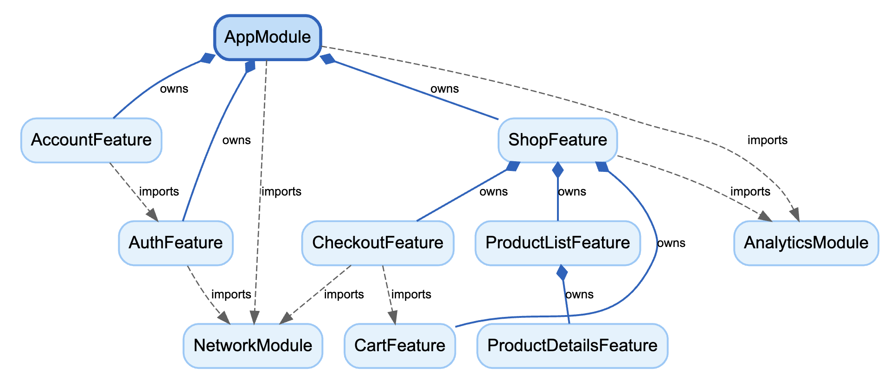

# Modularity Framework




A modular architecture framework for Flutter applications based on Clean Architecture & SOLID principles, designed for enterprise-scale applications where isolation, testability, and predictable lifecycle are paramount.

## 📦 Packages

The framework is divided into several packages to ensure separation of concerns:

- **[contracts](packages/contracts)**: Zero-dependency interfaces (`Module`, `Binder`, `Logger`, `Configurable`) that define the protocol of communication.
- **[core](packages/core)**: Core implementation of the dependency injection container (`SimpleBinder`) and the module state machine logic.
- **[flutter](packages/flutter)**: Flutter integration layer providing `ModuleScope`, `ModuleProvider`, and lifecycle management via `RouteObserver`.
- **[modularity_test](packages/modularity_test)**: Utilities for unit testing modules in isolation (`testModule`, `TestBinder`).
- **[modularity_cli](packages/modularity_cli)**: CLI tools for visualizing the dependency graph using Graphviz.

## 🚀 Features

- **Strict Dependency Injection**: Services can only be resolved within the module context. Explicit `imports` and `exports` prevent hidden dependencies.
- **Deterministic Lifecycle**: Modules have a formal state machine (`initial` -> `loading` -> `loaded` -> `disposed`). `onInit` is guaranteed to run after all dependencies are resolved.
- **Retention Policies**: Control how long a module lives.
  - `RouteBound`: Lives as long as the route is in the stack.
  - `KeepAlive`: Persists across navigation.
  - `Strict`: Disposed immediately when the widget is unmounted.
- **Observability**: Built-in `ModuleInterceptor` for logging and monitoring module transitions. CLI tools to generate dependency graphs.
- **Framework Agnostic Routing**: Designed to work with any router (GoRouter, AutoRoute, Navigator 1.0) via simple adapters.

## 💡 Ideas & Concepts

### Explicit Module Interface

We promote a pattern where each module strictly defines its dependency contract. This is crucial for maintaining a clean architecture in large-scale projects.

- **Local Dependencies (`binds`)**: Internal implementations (e.g., Repositories, Data Sources, Helpers) that are hidden from the outside world. These are your "private" members.
- **Exported Dependencies (`exports`)**: Public Interfaces (e.g., Services, Facades) that are provided to other modules. These are your "public" API.

This distinction ensures that modules remain **encapsulated black boxes**. You can refactor the internals of a module without affecting its consumers, as long as the exported contract remains the same.

## ⚖️ Comparison

How **Modularity** compares to other popular approaches in the Flutter ecosystem:

| Feature | Modularity (This Framework) | Flutter Modular | Melos / Feature Packages | Provider / Riverpod / BLoC |
| :--- | :--- | :--- | :--- | :--- |
| **Module Definition** | Pure Dart class + State Machine | Class with routes & binds | Separate Dart package | Folder structure / Providers list |
| **Initialization** | **Automatic (DAG)**: `onInit` runs after imports are ready | On navigation / module start | Manual orchestration in `main.dart` | Lazy or on widget mount |
| **Dependency Management** | **Explicit**: `imports` + `expects` + `exports` | Module tree / Global container | `pubspec.yaml` dependencies | `ProviderScope` / `MultiBlocProvider` |
| **Lifecycle** | **Formal**: `ModuleStatus` + Retention Policy | Bound to Modular's internal router | Undefined (mostly singletons) | Bound to Widget Tree context |
| **Routing Coupling** | **Loose**: Works with any router | **Strong**: Router is part of the framework | None | Indirect dependency |
| **Testing** | **Unit-first**: `testModule` isolates logic from UI | Integration tests mainly | Standard package tests | Widget tests (`pumpWidget`) required |
| **Observability** | **High**: Interceptors, Graphviz exports | Logging | None | DevTools of the specific lib |

## ✅ Pros & ❌ Cons

### Pros
- **Predictable Initialization**: Solves "Initialization Hell" by resolving the dependency graph (DAG) automatically before the module is ready.
- **Isolation**: Modules rely on abstract contracts, not concrete implementations of other modules.
- **Testability**: Logic can be tested without Flutter framework dependencies using `modularity_test`.
- **Observability**: You can visualize the entire app structure and track every state change.

### Cons
- **Boilerplate**: Requires writing explicit `imports`, `exports`, and `binds`. You cannot just "get" a service from anywhere.
- **Learning Curve**: Concepts like `Binder`, `Configurable`, and Module Lifecycle require understanding of the architectural pattern.
- **Strictness**: Might be overkill for small, simple applications or prototypes where development speed is prioritized over architectural purity.

## 🛠 Getting Started

### 1. Define a Module

```dart
import 'package:modularity_contracts/modularity_contracts.dart';

class AppModule extends Module {
  @override
  void binds(Binder i) {
    // Register a singleton
    i.singleton<AuthService>(() => AuthServiceImpl());
  }

  @override
  List<Module> get imports => [
    // Import other modules here
  ];
  
  @override
  Future<void> onInit() async {
    // Initialization logic (runs after imports are ready)
    await i.get<AuthService>().initialize();
  }
}
```

### 2. Initialize Root

Wrap your application in `ModularityRoot`.

```dart
void main() {
  runApp(ModularityRoot(
    child: MaterialApp(
      home: ModuleScope(
        module: AppModule(),
        child: HomePage(),
      ),
    ),
  ));
}
```

### 3. Use in UI

Access the module's binder via context (or extensions).

```dart
class HomePage extends StatelessWidget {
  @override
  Widget build(BuildContext context) {
    final authService = ModuleProvider.of(context).get<AuthService>();
    
    return Scaffold(
      body: Center(child: Text('Logged in: ${authService.isLoggedIn}')),
    );
  }
}
```

## 🧪 Testing

Use `modularity_test` to unit test your modules.

```dart
import 'package:modularity_test/modularity_test.dart';

void main() {
  test('AppModule registers AuthService', () async {
    await testModule(AppModule(), (module, binder) {
      expect(binder.get<AuthService>(), isNotNull);
    });
  });
}
```
