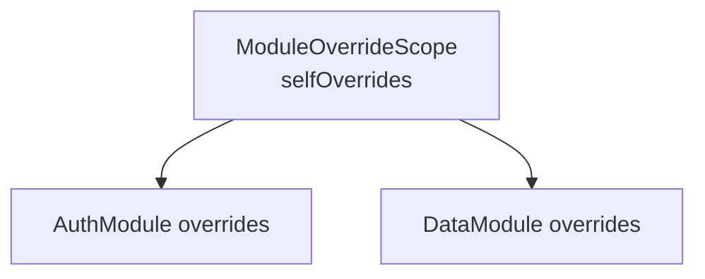
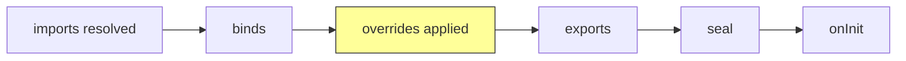

# 🔀 Dependency Overrides

Replace, extend, or intercept dependency registrations at any level of the module graph.

## Simple Overrides

Pass an `overrides` callback that runs **after** `binds()` but **before** `exports()`:

```dart
// On ModuleController (Dart):
final controller = ModuleController(
  NetworkModule(),
  overrides: (binder) {
    binder.registerSingleton<ApiService>(FakeApiService());
  },
);

// On ModuleScope (Flutter):
ModuleScope(
  module: NetworkModule(),
  overrides: (binder) {
    binder.registerSingleton<ApiService>(FakeApiService());
  },
  child: const NetworkPage(),
)
```

:::tip
Simple overrides only affect the root module's binder. To override bindings inside imported modules, use `ModuleOverrideScope`.
:::

## ModuleOverrideScope

A hierarchical tree that maps module types to override callbacks, targeting specific modules in the import graph.



### Structure

```dart
final overrideScope = ModuleOverrideScope(
  selfOverrides: (binder) { ... },      // Override root module
  children: {
    AuthModule: ModuleOverrideScope(
      selfOverrides: (binder) { ... },   // Override AuthModule
    ),
    DataModule: ModuleOverrideScope(
      selfOverrides: (binder) { ... },   // Override DataModule
      children: {
        CacheModule: ModuleOverrideScope(
          selfOverrides: (binder) { ... },
        ),
      },
    ),
  },
);
```

### Usage

```dart
final overrideScope = ModuleOverrideScope(
  children: {
    AuthModule: ModuleOverrideScope(
      selfOverrides: (binder) {
        binder.registerLazySingleton<AuthService>(() => FakeAuthService());
      },
    ),
  },
);

// On ModuleController:
final controller = ModuleController(
  AppModule(),
  overrideScopeTree: overrideScope,
);

// On ModuleScope (Flutter):
ModuleScope(
  module: AppModule(),
  overrideScope: overrideScope,
  child: const AppPage(),
)
```

### Composing Scopes

**`withAdditionalOverride()`** -- chains an override after existing `selfOverrides`:

```dart
final extended = baseScope.withAdditionalOverride((binder) {
  binder.registerSingleton<int>(42);
});
```

**`merge()`** -- combines two scopes; self overrides compose in order, children merge recursively:

```dart
final merged = scopeA.merge(scopeB);
// scopeA overrides run first, then scopeB
// Overlapping children are merged recursively
```

## Override Timing



::: info
Overrides run between `binds()` and `exports()`, so they replace private registrations before export. Dependencies resolved via `binder.get<T>()` in `exports()` pick up the overridden instances.
:::

::: tip Hot Reload
During `hotReload()`, overrides are re-applied with the same timing -- no additional setup needed.
:::

## Interceptors

`ModuleInterceptor` provides lifecycle hooks for cross-cutting concerns:

```dart
class TimingInterceptor implements ModuleInterceptor {
  final _timers = <Type, Stopwatch>{};

  @override
  void onInit(Module module) {
    _timers[module.runtimeType] = Stopwatch()..start();
  }

  @override
  void onLoaded(Module module) {
    final elapsed = _timers[module.runtimeType]?.elapsed;
    print('${module.runtimeType} loaded in $elapsed');
  }

  @override
  void onError(Module module, Object error) {
    print('${module.runtimeType} failed: $error');
  }

  @override
  void onDispose(Module module) {
    _timers.remove(module.runtimeType);
  }
}
```

| Event | When |
|-------|------|
| `onInit(module)` | Before initialization starts |
| `onLoaded(module)` | After `onInit()` completes successfully |
| `onError(module, error)` | When initialization throws |
| `onDispose(module)` | When the module is disposed |

### Per-controller vs Global

```dart
// Per-controller:
ModuleController(MyModule(), interceptors: [TimingInterceptor()]);

// Global (Flutter) -- applied to all ModuleScope widgets:
void main() {
  Modularity.interceptors.addAll([TimingInterceptor()]);
  runApp(ModularityRoot(child: MyApp()));
}
```

## Lifecycle Logging

Built-in logging for module retention events (creation, reuse, disposal, cache operations).

```dart
// Enable console logging:
Modularity.enableDebugLogging();

// Custom logger:
Modularity.lifecycleLogger = (event, moduleType, {retentionKey, details}) {
  myLogger.info('${event.name}: $moduleType key=$retentionKey');
};

// Disable:
Modularity.disableLogging();
```

Output example:
```
[Modularity] CREATED ProfileModule key=ProfileModule-/profile
[Modularity] REUSED ProfileModule key=ProfileModule-/profile
[Modularity] EVICTED ProfileModule key=ProfileModule-/profile
```

::: details ModuleLifecycleEvent enum values

| Event | Description |
|-------|-------------|
| `created` | Controller created for the first time |
| `reused` | Existing controller reused from cache |
| `registered` | Controller registered in retention cache |
| `disposed` | Controller disposed |
| `evicted` | Controller evicted from retention cache |
| `released` | Controller released (ref count decremented) |
| `routeTerminated` | Route termination triggered controller cleanup |

:::

## Common Use Cases

### Feature flags

```dart
ModuleScope(
  module: PaymentModule(),
  overrides: (binder) {
    if (FeatureFlags.newCheckout) {
      binder.registerLazySingleton<CheckoutFlow>(() => NewCheckoutFlow());
    }
  },
  child: const CheckoutPage(),
)
```

### Environment-specific DI

```dart
ModuleController(
  AppModule(),
  overrides: (binder) {
    if (kDebugMode) {
      binder.registerSingleton<AnalyticsService>(NoOpAnalytics());
    }
  },
);
```
