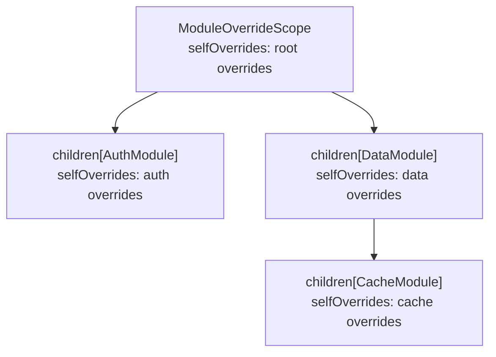
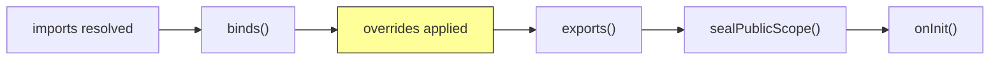

# Dependency Overrides

Replace, extend, or intercept dependency registrations at any level of the module graph.

## Simple Overrides

Pass an `overrides` callback to `ModuleScope` or `ModuleController`. It runs **after** `binds()` but **before** `exports()`:

```dart
// Flutter:
ModuleScope(
  module: NetworkModule(),
  overrides: (binder) {
    binder.registerSingleton<ApiService>(FakeApiService());
  },
  child: const NetworkPage(),
)

// Dart only:
final controller = ModuleController(
  NetworkModule(),
  overrides: (binder) {
    binder.registerSingleton<ApiService>(FakeApiService());
  },
);
```

Simple overrides only affect the root module's binder. To override bindings inside imported modules, use `ModuleOverrideScope`.

## ModuleOverrideScope

A hierarchical tree that maps module types to override callbacks, targeting specific modules in the import graph.



### Structure

```dart
final overrideScope = ModuleOverrideScope(
  selfOverrides: (binder) {
    // Override root module bindings
    binder.registerLazySingleton<Logger>(() => DebugLogger());
  },
  children: {
    AuthModule: ModuleOverrideScope(
      selfOverrides: (binder) {
        // Override AuthModule bindings
        binder.registerLazySingleton<AuthService>(() => FakeAuthService());
      },
    ),
    DataModule: ModuleOverrideScope(
      selfOverrides: (binder) {
        // Override DataModule bindings
        binder.registerFactory<DataMapper>(() => TestDataMapper());
      },
      children: {
        CacheModule: ModuleOverrideScope(
          selfOverrides: (binder) {
            binder.registerSingleton<CacheConfig>(TestCacheConfig());
          },
        ),
      },
    ),
  },
);
```

### API

| Property / Method | Description |
|-------------------|-------------|
| `selfOverrides` | `void Function(Binder)?` applied to the owning module's binder |
| `children` | `Map<Type, ModuleOverrideScope>` -- per-type overrides for imported modules |
| `childFor(Type)` | Returns the override scope for a specific imported module type |
| `withAdditionalOverride(override)` | Creates a new scope chaining `override` after existing `selfOverrides` |
| `merge(other)` | Combines two scopes: self overrides compose in order, children merge recursively |

### Usage

```dart
// Flutter:
ModuleScope(
  module: AppModule(),
  overrideScope: overrideScope,
  child: const AppPage(),
)

// Dart only:
final controller = ModuleController(
  AppModule(),
  overrideScopeTree: overrideScope,
);
```

### Composing Scopes

**`withAdditionalOverride()`** chains an override after existing `selfOverrides`:

```dart
final extended = baseScope.withAdditionalOverride((binder) {
  binder.registerSingleton<int>(42);
});
// baseScope.selfOverrides runs first, then the new override
```

**`merge()`** combines two scopes recursively:

```dart
final merged = scopeA.merge(scopeB);
// scopeA.selfOverrides -> scopeB.selfOverrides
// Overlapping children merge recursively
```

## Override Precedence

Overrides are applied in a well-defined order:



1. `ModuleOverrideScope.selfOverrides` runs after `binds()` but before `exports()`.
2. Overrides replace private registrations, so `exports()` sees the overridden instances.
3. When using `withAdditionalOverride()` or `merge()`, overrides compose left-to-right (first scope's overrides run first).
4. The `overrides` callback on `ModuleScope` is composed with `overrideScope.selfOverrides` via `withAdditionalOverride()`.

## Use Cases

### Testing -- Replace Real Services with Mocks

```dart
final testScope = ModuleOverrideScope(
  children: {
    AuthModule: ModuleOverrideScope(
      selfOverrides: (binder) {
        binder.registerLazySingleton<AuthService>(() => MockAuthService());
        binder.registerLazySingleton<TokenStore>(() => InMemoryTokenStore());
      },
    ),
  },
);

ModuleScope(
  module: AppModule(),
  overrideScope: testScope,
  child: const AppPage(),
)
```

### Feature Flags -- Swap Implementations

```dart
ModuleScope(
  module: PaymentModule(),
  overrides: (binder) {
    if (FeatureFlags.newCheckout) {
      binder.registerLazySingleton<CheckoutFlow>(() => NewCheckoutFlow());
    }
  },
  child: const CheckoutPage(),
)
```

### A/B Testing -- Different Implementation per Variant

```dart
final abScope = ModuleOverrideScope(
  selfOverrides: (binder) {
    final variant = AbTestService.variant('onboarding');
    switch (variant) {
      case 'control':
        binder.registerFactory<OnboardingFlow>(() => ClassicOnboarding());
      case 'experiment':
        binder.registerFactory<OnboardingFlow>(() => NewOnboarding());
    }
  },
);

ModuleScope(
  module: OnboardingModule(),
  overrideScope: abScope,
  child: const OnboardingPage(),
)
```

### Environment-Specific DI

```dart
ModuleController(
  AppModule(),
  overrides: (binder) {
    if (kDebugMode) {
      binder.registerSingleton<AnalyticsService>(NoOpAnalytics());
    }
  },
);
```

## Interaction with Retention

::: warning
`overrideScope` does **not** affect `retentionKey`. Two `ModuleScope` widgets with the same retention key but different override scopes **share** the same cached controller -- the first scope's overrides win.

To make overrides affect caching, include the scope identity in the retention key:

```dart
ModuleScope(
  module: MyModule(),
  retentionPolicy: ModuleRetentionPolicy.keepAlive,
  retentionKey: 'my-module-${identityHashCode(overrideScope)}',
  overrideScope: overrideScope,
  child: child,
)
```
:::

See [Module Retention](./module-retention.md) for details on retention keys.

## Interaction with Hot Reload

Overrides are automatically re-applied during `hotReload()` with the same timing -- no additional setup needed. Your test fakes and debug stubs survive hot reload.

See [Hot Reload](./hot-reload.md) for the full flow.

## Interceptors

`ModuleInterceptor` provides lifecycle hooks for cross-cutting concerns without modifying module code:

```dart
class TimingInterceptor implements ModuleInterceptor {
  final _timers = <Type, Stopwatch>{};

  @override
  void onInit(Module module) {
    _timers[module.runtimeType] = Stopwatch()..start();
  }

  @override
  void onLoaded(Module module) {
    final elapsed = _timers[module.runtimeType]?.elapsed;
    debugPrint('${module.runtimeType} loaded in $elapsed');
  }

  @override
  void onError(Module module, Object error) {
    debugPrint('${module.runtimeType} failed: $error');
  }

  @override
  void onDispose(Module module) {
    _timers.remove(module.runtimeType);
  }
}
```

| Event | When |
|-------|------|
| `onInit(module)` | Before initialization starts |
| `onLoaded(module)` | After `onInit()` completes successfully |
| `onError(module, error)` | When initialization throws |
| `onDispose(module)` | When the module is disposed |

### Per-Controller vs Global

```dart
// Per-controller:
ModuleController(MyModule(), interceptors: [TimingInterceptor()]);

// Global (Flutter) -- applied to all ModuleScope widgets:
void main() {
  Modularity.interceptors.addAll([TimingInterceptor()]);
  runApp(ModularityRoot(child: MyApp()));
}
```

## Lifecycle Logging

Built-in logging for module retention events:

```dart
// Enable console logging:
Modularity.enableDebugLogging();

// Custom logger:
Modularity.lifecycleLogger = (event, moduleType, {retentionKey, details}) {
  myLogger.info('${event.name}: $moduleType key=$retentionKey');
};

// Disable:
Modularity.disableLogging();
```

::: details ModuleLifecycleEvent values

| Event | Description |
|-------|-------------|
| `created` | Controller created for the first time |
| `reused` | Existing controller reused from cache |
| `registered` | Controller registered in retention cache |
| `disposed` | Controller disposed |
| `evicted` | Controller evicted from retention cache |
| `released` | Controller released (ref count decremented) |
| `routeTerminated` | Route termination triggered cleanup |

:::
