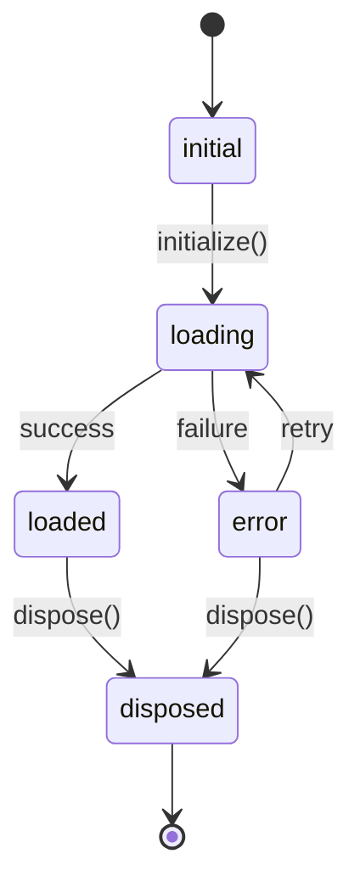

# Getting Started

Add Modularity to a Flutter app, create a module, and access dependencies from the widget tree.

## Installation

```yaml
dependencies:
  modularity_core: ^0.2.0
  modularity_flutter: ^0.2.0
```

`modularity_contracts` is pulled in automatically.

::: tip Dart Workspace
In a monorepo, list packages under the root `pubspec.yaml` with a `workspace:` key. Each member needs `resolution: workspace` in its own pubspec.
:::

## Create a Module

Extend `Module`. Register private dependencies in `binds()` and public ones in `exports()`:

```dart
import 'package:modularity_core/modularity_core.dart';

class AuthModule extends Module {
  @override
  void binds(Binder i) {
    i.registerLazySingleton<AuthRepository>(() => AuthRepositoryImpl());
    i.registerFactory<LoginUseCase>(
      () => LoginUseCase(i.get<AuthRepository>()),
    );
  }

  @override
  void exports(Binder i) {
    i.registerLazySingleton<AuthService>(
      () => AuthService(i.get<AuthRepository>()),
    );
  }
}
```

- `binds()` -- private to this module. Internal implementation details stay hidden.
- `exports()` -- visible to modules that import `AuthModule`. Only public-facing interfaces belong here.

### Registration Methods

| Method | Behaviour |
|--------|-----------|
| `registerLazySingleton<T>(() => ...)` | Created once on first `get<T>()` call |
| `registerFactory<T>(() => ...)` | New instance on every `get<T>()` call |
| `registerSingleton<T>(instance)` | Eager -- same pre-created instance always |

## Wire the App

Two widgets connect modules to Flutter:

| Widget | Role |
|--------|------|
| `ModularityRoot` | Top-level `InheritedWidget`. Holds the global registry and `BinderFactory`. |
| `ModuleScope<T>` | Manages one module's lifecycle and exposes its binder to descendants. |

::: warning RouteObserver is Required
The default retention policy is `routeBound`, which disposes the module when its route is popped. This requires a `RouteObserver` passed to both `ModularityRoot(observer: ...)` and `MaterialApp(navigatorObservers: [...])`. Without it, route-bound disposal will not work. If you don't need route-bound retention, set `retentionPolicy: ModuleRetentionPolicy.strict` on your `ModuleScope`.
:::

```dart
import 'package:flutter/material.dart';
import 'package:modularity_flutter/modularity_flutter.dart';

final observer = RouteObserver<ModalRoute<dynamic>>();

class MyApp extends StatelessWidget {
  const MyApp({super.key});

  @override
  Widget build(BuildContext context) {
    return ModularityRoot(
      observer: observer,
      defaultLoadingBuilder: (_) =>
          const Center(child: CircularProgressIndicator()),
      defaultErrorBuilder: (_, error, retry) => Center(
        child: TextButton(onPressed: retry, child: Text('Retry: $error')),
      ),
      child: MaterialApp(
        navigatorObservers: [observer],
        home: ModuleScope<AuthModule>(
          module: AuthModule(),
          child: const LoginPage(),
        ),
      ),
    );
  }
}
```

`ModularityRoot` must be above any `ModuleScope` in the widget tree.

## Access Dependencies

Use `ModuleProvider.of(context)` inside a `ModuleScope` subtree to get the `Binder`:

```dart
class LoginPage extends StatelessWidget {
  const LoginPage({super.key});

  @override
  Widget build(BuildContext context) {
    final authService = ModuleProvider.of(context).get<AuthService>();

    return ElevatedButton(
      onPressed: () => authService.login(),
      child: const Text('Sign In'),
    );
  }
}
```

### Lookup Methods

| Method | Returns | When not found |
|--------|---------|----------------|
| `get<T>()` | `T` | Throws `DependencyNotFoundException` |
| `tryGet<T>()` | `T?` | Returns `null` |
| `parent<T>()` | `T` | Throws (parent scope only) |
| `tryParent<T>()` | `T?` | Returns `null` (parent scope only) |

::: info Resolution Order
`get<T>()` searches scopes in this order:

1. **Local** -- private + public bindings of the current module
2. **Imports** -- public exports of imported modules
3. **Parent** -- nearest ancestor `ModuleScope`

If nothing matches, `DependencyNotFoundException` is thrown with a list of available types.
:::

### Get the Module Instance

Access the module object itself when you need to call methods on it:

```dart
final auth = ModuleProvider.moduleOf<AuthModule>(context);
```

## Module Lifecycle

`ModuleController` drives a deterministic lifecycle:



| Hook | Timing |
|------|--------|
| `binds(Binder i)` | Sync, after imports resolved and `expects` validated |
| `exports(Binder i)` | Sync, right after `binds()` |
| `onInit()` | Async, after binds/exports complete |
| `onDispose()` | On controller disposal |

### Loading and Error UI

`ModuleScope` supports per-scope builders for loading and error states:

```dart
ModuleScope<PaymentModule>(
  module: PaymentModule(),
  loadingBuilder: (_) => const Shimmer(),
  errorBuilder: (_, error, retry) => ErrorBanner(
    message: error.toString(),
    onRetry: retry,
  ),
  child: const PaymentForm(),
)
```

Fallback order: per-scope builder, then `ModularityRoot` defaults, then built-in placeholder. The `retry` callback disposes the failed controller and re-runs the full initialization cycle.

## Next Steps

- [Module Architecture](./module-architecture.md) -- visibility rules, imports, parent scope, `expects`, configurable modules
- [Module Retention](./module-retention.md) -- `routeBound`, `keepAlive`, `strict` policies
- [Dependency Overrides](./dependency-overrides.md) -- override bindings for testing, feature flags, and environment-specific DI
- [Testing Modules](./testing-modules.md) -- unit tests, widget tests, mocking strategies
- [Hot Reload](./hot-reload.md) -- how singleton state survives hot reload
