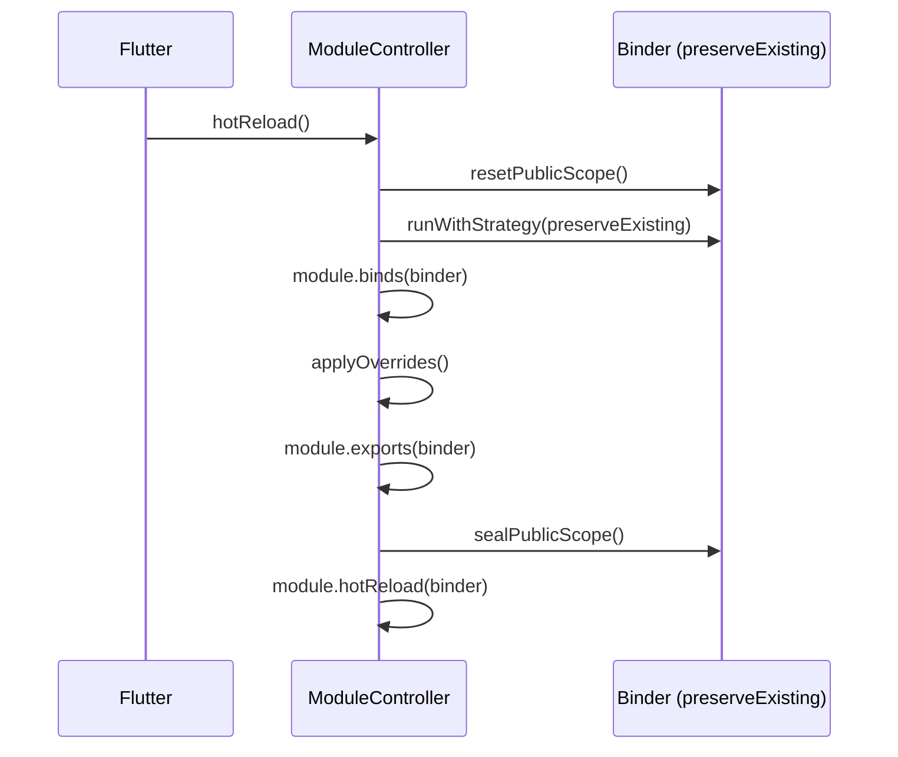

# Hot Reload

Modularity preserves singleton state during Flutter hot reload. Factory closures and lazy singleton factories are updated, but already-created instances survive.

## How It Works

When Flutter triggers a hot reload, `ModuleScope` rebuilds and calls `ModuleController.hotReload()`. The controller re-runs `binds()` and `exports()` under `RegistrationStrategy.preserveExisting`, which replaces factory closures but keeps existing singleton instances intact.

No need to recreate controllers or restart the app.

## Registration Strategy

`RegistrationStrategy` (from `modularity_contracts`) defines how duplicate registrations are handled:

| Strategy | Behavior |
|----------|----------|
| `replace` | Re-registration overwrites the existing entry (default) |
| `preserveExisting` | Existing singleton instances are kept; only the factory closure is updated |

`SimpleBinder` and `GetItBinder` (from `modularity_get_it`) both implement `RegistrationAwareBinder`. `ModuleController.hotReload()` automatically wraps rebinds in `runWithStrategy(RegistrationStrategy.preserveExisting, ...)`.

::: warning
`modularity_injectable`'s `GetItBinder` does **not** implement `RegistrationAwareBinder`. If you use the injectable integration, hot-reload strategy switching is not available through the binder directly.
:::

## Internal Flow

`ModuleController.hotReload()` executes the following steps:

1. Checks that the module is in `loaded` status (no-op otherwise).
2. For `RegistrationAwareBinder`: wraps all subsequent calls in `runWithStrategy(preserveExisting, ...)`.
3. For `ExportableBinder`: calls `resetPublicScope()` to unseal exports.
4. Runs in order:
   - `disableExportMode()`
   - `module.binds(binder)` -- factory closures updated, existing singletons preserved
   - `_applyOverridesIfNeeded()` -- re-applies `ModuleOverrideScope.selfOverrides`
   - `enableExportMode()`
   - `module.exports(binder)`
   - `disableExportMode()`
   - `sealPublicScope()`
5. Invokes `module.hotReload(binder)` -- your custom hook.



## What Survives

| Registration type | Factory closure | Instance |
|-------------------|----------------|----------|
| `registerLazySingleton` | Updated | Preserved (if already created) |
| `registerFactory` | Updated | N/A (new instance each call) |
| `registerSingleton` | N/A | Preserved |
| New type (not yet registered) | Added | Created on first access |

## The hotReload() Hook

Override `hotReload()` in your module to run custom logic after rebinding:

```dart
class AuthModule extends Module {
  @override
  void binds(Binder i) {
    i.registerLazySingleton<AuthRepo>(() => AuthRepoImpl());
    i.registerFactory<AuthValidator>(() => AuthValidator());
  }

  @override
  void hotReload(Binder i) {
    // Runs after binds/exports have been refreshed.
    // Use for cache invalidation, re-subscription, etc.
  }
}
```

This hook is called **after** all binds, overrides, and exports have been re-applied.

## Overrides and Hot Reload

`ModuleOverrideScope` overrides are automatically re-applied during hot reload via `_applyOverridesIfNeeded()`. This means test fakes and debug stubs survive hot reload without extra wiring.

```dart
ModuleScope(
  module: AppModule(),
  overrideScope: ModuleOverrideScope(
    children: {
      AuthModule: ModuleOverrideScope(
        selfOverrides: (binder) {
          binder.registerLazySingleton<AuthApi>(() => FakeAuthApi());
        },
      ),
    },
  ),
  child: const AppPage(),
)
// FakeAuthApi survives hot reload -- re-applied automatically
```

See [Dependency Overrides](./dependency-overrides.md) for full `ModuleOverrideScope` documentation.

## Manual Strategy Switching

Any `RegistrationAwareBinder` exposes `runWithStrategy` for targeted factory updates:

```dart
final binder = ModuleProvider.of(context);
if (binder is RegistrationAwareBinder) {
  binder.runWithStrategy(
    RegistrationStrategy.preserveExisting,
    () {
      binder.registerFactory<Foo>(() => UpdatedFoo());
      binder.registerLazySingleton<Bar>(() => UpdatedBar());
    },
  );
}
```

::: warning
Use manual strategy switching only when you need rebind behavior that preserves existing instances outside of the normal hot reload flow.
:::

## Limitations

- **Structural changes** -- Adding new modules to `imports`, changing the module graph topology, or adding/removing `ModuleScope` widgets requires a full restart.
- **New module types** -- If a hot reload introduces a new `Module` subclass that wasn't in the widget tree before, it won't be automatically picked up -- rebuild the parent widget or restart.
- **Non-RegistrationAwareBinder** -- If your custom binder does not implement `RegistrationAwareBinder`, `hotReload()` calls `binds()` and `exports()` with the default `replace` strategy. Existing singletons may be lost.
- **Public scope seal** -- Manual re-export outside `hotReload()` throws because `sealPublicScope()` blocks new registrations. The controller handles unsealing internally during hot reload.

## FAQ

**Do I need to manually reset singletons?**
No. To restart a module from scratch, dispose the controller and create a new `ModuleController`.

**Why does re-registering a public binding throw?**
The public scope is protected by `sealPublicScope()`. During `hotReload()`, `resetPublicScope()` is called first. Manual re-export outside that flow is blocked.

**How do I test hot reload behavior?**
`dart test packages/core/test/` includes `HotReloadModule` tests that verify singleton preservation and factory refresh. For GetIt-specific behavior, see `packages/adapters/modularity_get_it/test/`.

**Does `onInit()` re-run on hot reload?**
No. `hotReload()` only re-runs `binds()`, overrides, `exports()`, and the `hotReload()` hook. The `onInit()` lifecycle is skipped.
