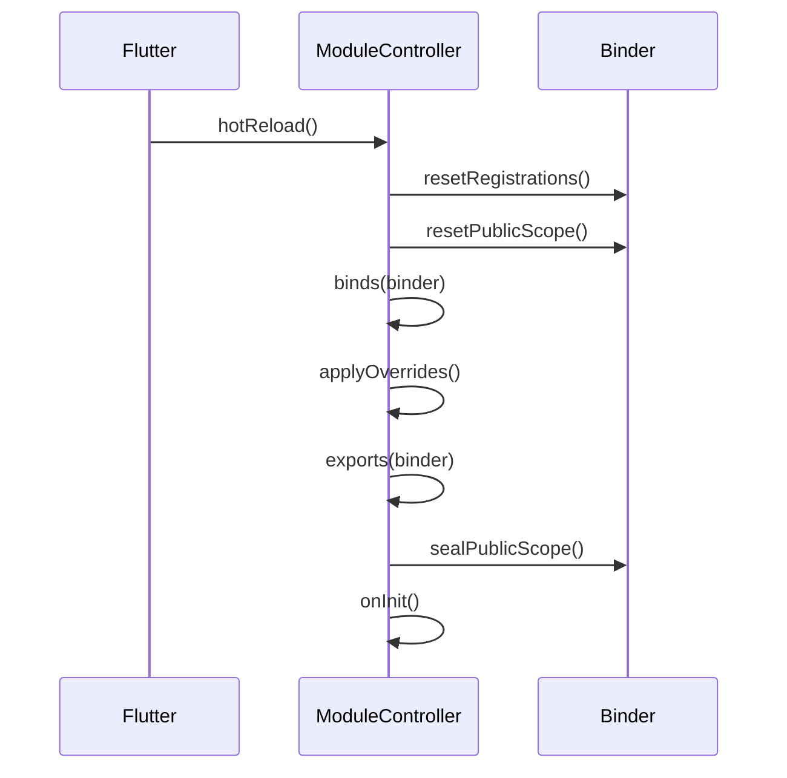

# 🔥 Hot Reload

Modularity preserves singleton state during Flutter hot reload. Factories and lazy singletons get updated, but already-created instances survive.

## What happens on hot reload

- Existing singleton and `registerSingleton` instances are preserved.
- `registerFactory` and `registerLazySingleton` delegates are replaced.
- `ModuleOverrideScope` overrides and the `module.hotReload()` hook are re-applied automatically.

No need to recreate controllers or restart the app.

## RegistrationStrategy

`modularity_contracts` defines `RegistrationStrategy` and `RegistrationAwareBinder`:

::: info Strategy overview
| Strategy | Behaviour |
|----------|-----------|
| `replace` | Re-registration overwrites the existing entry (default) |
| `preserveExisting` | Singletons are kept; only the factory delegate is updated |
:::

`SimpleBinder` and `GetItBinder` (from `modularity_get_it`) both implement `RegistrationAwareBinder`. `ModuleController.hotReload()` automatically wraps rebinds in `runWithStrategy(RegistrationStrategy.preserveExisting, ...)`, so manual strategy switching is not needed in normal usage.

::: warning
`modularity_injectable`'s `GetItBinder` does **not** implement `RegistrationAwareBinder`. If you use the injectable integration, hot-reload strategy switching is not available through the binder directly.
:::

::: tip
If you implement a custom binder, implement `RegistrationAwareBinder` and respect `registrationStrategy` in your `register*` methods.
:::

## How hotReload() works

`ModuleController.hotReload()` executes the following steps:

1. Checks the module is in `loaded` status (no-op otherwise).
2. For `ExportableBinder`: calls `resetPublicScope()` to allow re-registration.
3. Switches binder to `preserveExisting` strategy.
4. Runs in order:
   - `module.binds(binder)`
   - override re-application (if `ModuleOverrideScope` was provided)
   - `module.exports(binder)`
   - `sealPublicScope()`
5. Invokes `module.hotReload(binder)` -- your custom hook.



### The hotReload hook

Override `hotReload()` in your module to run custom logic after rebinding:

```dart
class AuthModule extends Module {
  @override
  void binds(Binder i) {
    i.registerLazySingleton<AuthRepo>(() => AuthRepoImpl());
  }

  @override
  void hotReload(Binder i) {
    // Runs after binds/exports have been refreshed.
    // Use for cache invalidation, re-subscription, etc.
  }
}
```

## Overrides and hot reload

`ModuleOverrideScope` describes an override tree: `selfOverrides` for the current module, `children` for imported modules.

```dart
final overrides = ModuleOverrideScope(children: {
  AuthModule: ModuleOverrideScope(
    selfOverrides: (binder) =>
        binder.registerLazySingleton<AuthApi>(() => FakeAuthApi()),
  ),
});
```

- Flutter: `ModuleScope(overrideScope: overrides, ...)`
- Tests: `testModule` (from `modularity_test`) `(MyModule(), body, overrideScope: overrides)`

::: tip
Overrides run after `binds()` but before `exports()`, and are automatically re-applied on every `hotReload()` call. This means your test fakes and debug stubs survive hot reload without any extra wiring.
:::

## Manual strategy switching

Any `RegistrationAwareBinder` exposes `runWithStrategy` for targeted factory updates:

```dart
final binder = ModuleProvider.of(context);
if (binder is RegistrationAwareBinder) {
  binder.runWithStrategy(
    RegistrationStrategy.preserveExisting,
    () {
      binder.registerFactory<Foo>(() => Foo());
      binder.registerLazySingleton<Bar>(() => Bar());
    },
  );
}
```

::: warning
Use manual strategy switching only when you explicitly need rebind behaviour that preserves existing instances outside of the normal hot reload flow.
:::

## FAQ

**Do I need to manually reset singletons?**
No. To restart a module from scratch, call `controller.dispose()` and create a new `ModuleController`.

**Why does re-registering a public binding throw an error?**
The public scope is protected by `sealPublicScope()`. During `hotReload()`, `resetPublicScope()` is called first, so re-registration works. Manual re-export outside that context is intentionally blocked.

**How do I test hot reload behaviour?**
`dart test packages/core/test/` includes `HotReloadModule` tests that verify singleton preservation and factory refresh. For GetIt-specific behaviour, see `packages/adapters/modularity_get_it/test/`.
