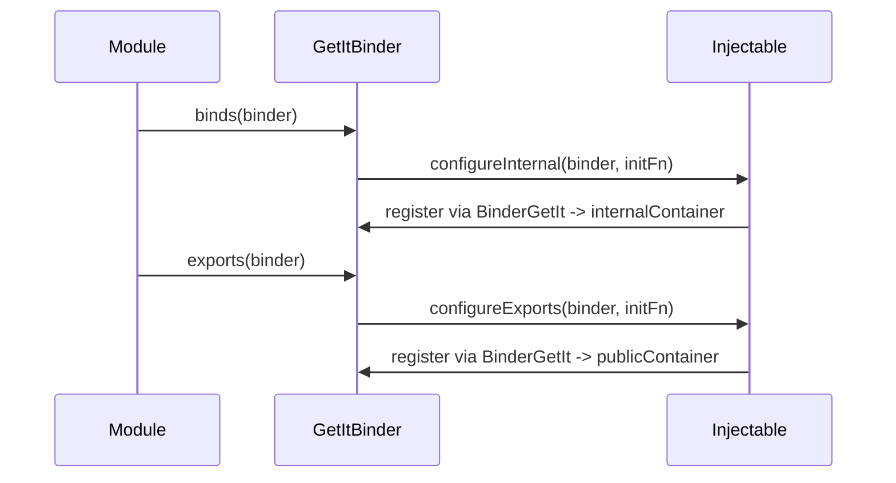
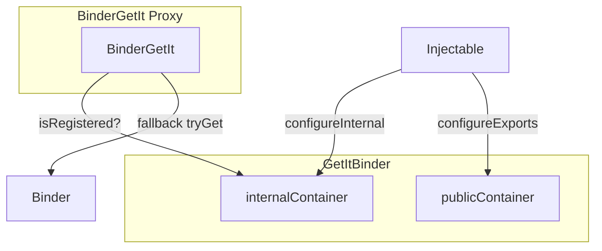

# Injectable Integration

The `modularity_injectable` package connects [injectable](https://pub.dev/packages/injectable) code generation with Modularity's module boundaries. Instead of writing manual `binds()`/`exports()` registrations, you annotate classes and let `build_runner` generate the wiring.

## The Problem It Solves

Manual registration works well for small modules but becomes tedious at scale:

```dart
// 15+ lines of manual wiring per module
void binds(Binder i) {
  i.registerLazySingleton<UserRepository>(() => UserRepositoryImpl(i.get<Database>()));
  i.registerLazySingleton<UserService>(() => UserService(i.get<UserRepository>()));
  i.registerFactory<GetUserUseCase>(() => GetUserUseCase(i.get<UserService>()));
  // ...many more
}
```

With injectable, you annotate each class once and the generator handles constructor injection automatically. `modularity_injectable` bridges the generated code into Modularity's dual-scope (private/public) model.

## When to Use

| Approach | Best for |
|----------|----------|
| Manual `binds()`/`exports()` | Small modules (< 5 registrations), no build_runner |
| `modularity_injectable` | 10+ dependencies, constructor auto-injection, teams already on injectable/get_it |

Both approaches coexist in the same app.

## Setup

### 1. Add dependencies

```yaml
dependencies:
  modularity_core: ^0.2.0
  modularity_injectable: ^0.2.0
  get_it: ^8.0.0
  injectable: ^2.3.0

dev_dependencies:
  build_runner: ^2.4.0
  injectable_generator: ^2.4.0
```

### 2. Configure the binder factory

Injectable integration requires `GetItBinder` -- the dual-scope binder from `modularity_injectable`. It manages two isolated GetIt containers: one for private registrations, one for exports.

**Flutter:**

```dart
import 'package:modularity_flutter/modularity_flutter.dart';
import 'package:modularity_injectable/modularity_injectable.dart';

ModularityRoot(
  binderFactory: const GetItBinderFactory(),
  child: ModuleScope(
    module: RootModule(),
    child: const MyApp(),
  ),
);
```

**Pure Dart:**

```dart
import 'package:modularity_injectable/modularity_injectable.dart';

final controller = ModuleController(
  RootModule(),
  binder: GetItBinder(),
  binderFactory: const GetItBinderFactory(),
);
await controller.initialize({});
```

## Annotating Dependencies

### Private (module-internal)

Standard injectable annotations without an export marker stay private to the module:

```dart
@LazySingleton(as: AuthRepository)
class AuthRepositoryImpl implements AuthRepository {
  AuthRepositoryImpl(this._apiClient);
  final ApiClient _apiClient;
}

@Injectable()
class LoginUseCase {
  LoginUseCase(this._repo);
  final AuthRepository _repo;
}
```

- `@LazySingleton()` -- one instance per module scope, created on first access.
- `@Injectable()` -- new instance on every resolve.
- `@LazySingleton(as: AbstractType)` -- register an implementation against its interface.

### Exported (visible to importing modules)

Add the `modularity_export` environment to make a dependency public. Two equivalent syntaxes:

```dart
import 'package:modularity_injectable/modularity_injectable.dart';

// Option A: env parameter
@LazySingleton(env: [modularityExportEnvName])
class AuthService {
  AuthService(this._repo);
  final AuthRepository _repo;
}

// Option B: separate annotation
@modularityExportEnv
@LazySingleton()
class AuthFacade {
  AuthFacade(this._service);
  final AuthService _service;
}
```

`modularityExportEnvName` is the string `'modularity_export'`. `modularityExportEnv` is `const Environment('modularity_export')`.

## Wiring the Module

### 1. Create the injectable config file

```dart
// lib/modules/auth/auth_injectable.dart
import 'package:get_it/get_it.dart';
import 'package:injectable/injectable.dart';

import 'auth_injectable.config.dart';

@InjectableInit(initializerName: 'initAuthDeps', asExtension: false)
GetIt initAuthDeps(
  GetIt getIt, {
  String? environment,
  EnvironmentFilter? environmentFilter,
}) =>
    $initAuthDeps(
      getIt,
      environment: environment,
      environmentFilter: environmentFilter,
    );
```

Run code generation:

```bash
dart run build_runner build --delete-conflicting-outputs
```

### 2. Wire into the Module

```dart
import 'package:modularity_core/modularity_core.dart';
import 'package:modularity_injectable/modularity_injectable.dart';

import 'auth_injectable.dart';

class AuthModule extends Module {
  @override
  void binds(Binder i) {
    ModularityInjectableBridge.configureInternal(i, initAuthDeps);
  }

  @override
  void exports(Binder i) {
    ModularityInjectableBridge.configureExports(i, initAuthDeps);
  }

  @override
  List<Type> get expects => [ApiClient];
}
```

- `configureInternal` registers **all** annotated dependencies into the private scope via `GetItBinder.internalContainer`.
- `configureExports` registers **only** dependencies tagged with `modularity_export` into the public scope via `GetItBinder.publicContainer`, using a `ModularityExportOnly` environment filter.

### Registration flow



### Mixing manual and generated registrations

You can combine both approaches in a single module:

```dart
class AuthModule extends Module {
  @override
  void binds(Binder i) {
    ModularityInjectableBridge.configureInternal(i, initAuthDeps);
    // Manual registration alongside generated ones
    i.registerSingleton<AuthConfig>(AuthConfig.fromEnv());
  }

  @override
  void exports(Binder i) {
    ModularityInjectableBridge.configureExports(i, initAuthDeps);
  }
}
```

## How It Works

### Dual-scope GetItBinder

Each `GetItBinder` instance manages two isolated GetIt containers:

- **Private scope** (`internalContainer`) -- receives `binds()` registrations.
- **Public scope** (`publicContainer`) -- receives `exports()` registrations.



Dependency resolution order in `GetItBinder.get<T>()`:

1. Private scope (local `binds()`)
2. Public scope (local `exports()`)
3. Imports (public exports from imported modules)
4. Parent module's binder

### BinderGetIt -- the GetIt proxy

Injectable-generated factories call `getIt.get<T>()` for constructor parameters. `BinderGetIt` implements the `GetIt` interface and intercepts `get<T>()` to bridge Modularity's scoping with GetIt's flat registry.

Resolution inside `BinderGetIt.get<T>()`:

1. Named/parameterized lookups delegate directly to GetIt.
2. If `T` is registered locally, return it.
3. Otherwise, fall back to `Binder.tryGet<T>()` (walks imports + parent).
4. If still unresolved, throw native GetIt error.

This lets injectable factories depend on types from imported modules automatically:

```dart
// ApiClient is exported by NetworkModule (an import).
// Injectable resolves it through BinderGetIt -- no manual i.get() needed.
@LazySingleton()
class AuthRepositoryImpl implements AuthRepository {
  AuthRepositoryImpl(this._apiClient);
  final ApiClient _apiClient;
}
```

### Error handling

Passing a non-GetIt binder (e.g. `SimpleBinder`) to the bridge throws `ModuleConfigurationException`:

```
ModuleConfigurationException: Injectable integration requires GetItBinder.
Provide GetItBinderFactory to ModularityRoot or ModuleController.
```

Set `GetItBinderFactory` on `ModularityRoot` (or `ModuleController` for pure Dart) before using the bridge.

## When to Use Injectable vs Plain Modularity

**Use injectable when:**
- Module has 10+ dependency registrations.
- You want constructor auto-injection (no manual `i.get<T>()` calls in factories).
- Team is already familiar with injectable/get_it conventions.

**Use plain `binds()`/`exports()` when:**
- Module has fewer than 5 registrations.
- You want zero code generation overhead.
- Dependencies don't have complex constructor chains.

Both approaches produce identical runtime behavior. The difference is only in how registrations are authored.
