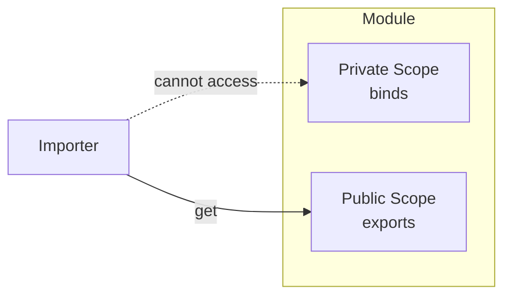
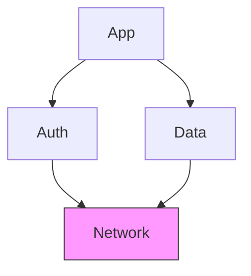
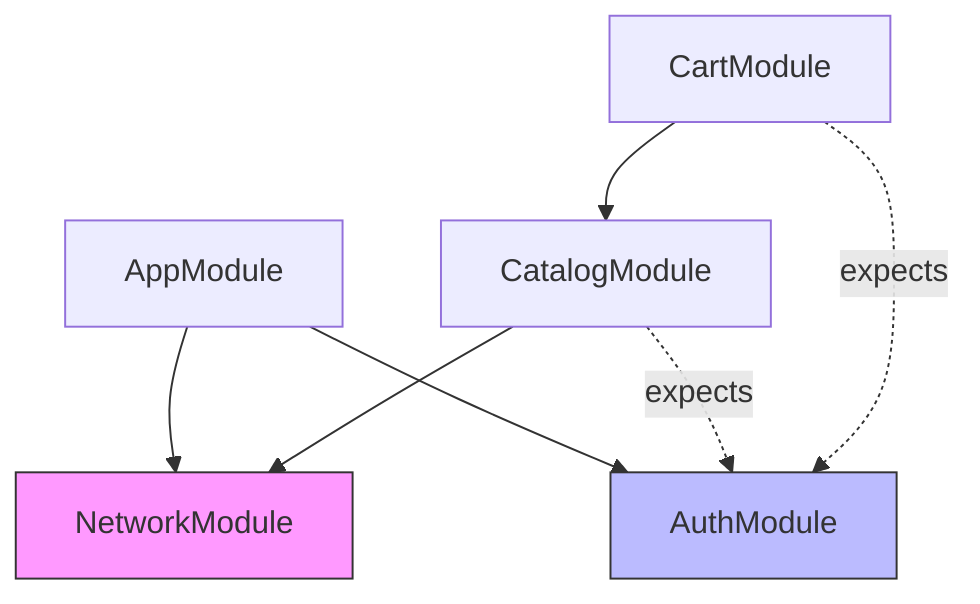

# Module Architecture

Visibility control, imports, parent scope chaining, the `expects` contract, configurable modules, and the difference between `submodules` and `imports`.

## Module Structure

Each module has two scopes managed by `ExportableBinder`:

- `binds()` registers **private** dependencies -- internal implementation details invisible to other modules.
- `exports()` registers **public** dependencies -- the only surface importers can access.

```dart
class NetworkModule extends Module {
  @override
  void binds(Binder i) {
    i.registerLazySingleton<HttpInterceptor>(() => LoggingInterceptor());
    i.registerLazySingleton<HttpClient>(
      () => HttpClient(interceptor: i.get<HttpInterceptor>()),
    );
  }

  @override
  void exports(Binder i) {
    i.registerLazySingleton<ApiClient>(
      () => ApiClient(http: i.get<HttpClient>()),
    );
  }
}
```

After `exports()` completes, the public scope is **sealed**. Further export registrations throw `ModuleConfigurationException`.



## Visibility Rules

| Caller | `binds()` types | `exports()` types | Parent scope |
|--------|:-:|:-:|:-:|
| Module itself | yes | yes | yes |
| Importing module | no | yes | no |
| Child (nested) `ModuleScope` | no | no | yes (via `parent<T>()`) |

The internal `binds()` of a module is never exposed outside its own scope. `exports()` is only visible through the `imports` mechanism. Parent scope is accessed implicitly through the widget tree.

## Imports

Override the `imports` getter to declare runtime dependencies. `GraphResolver` initializes all imports **concurrently** before calling the importing module's `binds()`.

```dart
class ProfileModule extends Module {
  @override
  List<Module> get imports => [AuthModule(), NetworkModule()];

  @override
  void binds(Binder i) {
    i.registerFactory<ProfileRepository>(
      () => ProfileRepository(
        auth: i.get<AuthService>(),   // from AuthModule.exports()
        api: i.get<ApiClient>(),      // from NetworkModule.exports()
      ),
    );
  }
}
```

### Graph Resolution

1. `GraphResolver.resolveAndInitImports()` processes `module.imports`.
2. Each import initializes **concurrently** via `Future.wait`.
3. Same module type imported by multiple branches is **deduplicated** -- first creator wins, others await.
4. **Circular dependencies** (`A -> B -> A`) throw `CircularDependencyException` with the full chain.
5. Resolved binders are injected via `binder.addImports()`.

### Diamond Dependencies

If B and C both import D, only one D controller is created. Both share it from the global registry.



`Network` is initialized once. The second import awaits the already-running initialization and reuses the same controller.

## Parent Scope

Nested `ModuleScope` widgets form an implicit parent chain. The child's `SimpleBinder` receives the parent binder as a fallback.

```dart
// Widget tree:
// ModuleScope<AppModule>
//   +-- ModuleScope<FeatureModule>
//         +-- FeatureWidget
```

```dart
class FeatureModule extends Module {
  @override
  void binds(Binder i) {
    i.registerFactory<FeatureService>(
      () => FeatureService(analytics: i.parent<AnalyticsService>()),
    );
  }
}
```

| Method | Scope |
|--------|-------|
| `get<T>()` / `tryGet<T>()` | Local -> Imports -> Parent (full chain) |
| `parent<T>()` / `tryParent<T>()` | Parent scope only |

Use `parent<T>()` when you need to **skip** local and import scopes explicitly -- for example, to avoid shadowing a type that exists in both scopes.

## expects

Declare types that **must** exist before the module initializes. Missing types fail fast with `ModuleConfigurationException` instead of a late `DependencyNotFoundException`.

```dart
class OrderModule extends Module {
  @override
  List<Type> get expects => [AuthService, ApiClient];

  @override
  List<Module> get imports => [PaymentModule()];

  @override
  void binds(Binder i) {
    i.registerFactory<OrderService>(
      () => OrderService(
        auth: i.get<AuthService>(),
        api: i.get<ApiClient>(),
        payment: i.get<PaymentService>(),
      ),
    );
  }
}
```

::: warning Validation timing
`expects` is checked **after** imports are resolved but **before** `binds()` runs. The check uses `binder.contains(type)`, which searches imports + parent. Expected types can come from either source.
:::

Use `expects` when a module depends on types provided by a **parent scope** rather than its own imports. Types from imports don't need to be listed in `expects` -- they are guaranteed by the import resolution.

## Configurable Modules

Modules that need runtime parameters implement `Configurable<T>`. The `configure(T args)` method runs **before** `binds()`.

```dart
class UserProfileModule extends Module implements Configurable<String> {
  late final String _userId;

  @override
  void configure(String args) {
    _userId = args;
  }

  @override
  void binds(Binder i) {
    i.registerLazySingleton<UserRepository>(
      () => UserRepository(userId: _userId),
    );
  }
}
```

Pass arguments via `ModuleScope.args`:

```dart
ModuleScope<UserProfileModule>(
  module: UserProfileModule(),
  args: userId,
  child: const UserProfilePage(),
)
```

Full lifecycle order:

```
configure(args) -> imports resolved -> expects validated -> binds() -> overrides -> exports() -> seal -> onInit()
```

If the wrong argument type is passed, `ModuleController` wraps the error in a `ModuleLifecycleException`.

## Submodules

`submodules` is a separate concept from `imports`. It exists for **static analysis and visualization only** -- the framework does not initialize submodules at runtime.

| | `imports` | `submodules` |
|--|-----------|-------------|
| **Purpose** | Runtime DI | Static analysis and visualization |
| **Initialization** | Resolved by `GraphResolver` | Not initialized by the framework |
| **Binder access** | Public exports injected into importer | No binder connection |
| **Use case** | Need types from another module | Document feature composition for CLI tooling |

```dart
class AppModule extends Module {
  @override
  List<Module> get submodules => [
    AuthModule(),
    ProfileModule(),
    SettingsModule(),
  ];

  @override
  void binds(Binder i) {
    i.registerSingleton<AppConfig>(AppConfig());
  }
}
```

Submodules are consumed by `modularity_cli` tools (`ModuleBindingsAnalyzer`, `GraphVisualizer`) for dependency graph visualization. They should use `Configurable` instead of constructor arguments so tooling can instantiate them cleanly.

A module can appear in both `imports` and `submodules` if needed.

## Architecture Example

A typical e-commerce app with shared infrastructure and feature modules:

```dart
class AppModule extends Module {
  @override
  List<Module> get imports => [NetworkModule(), AuthModule()];

  @override
  void binds(Binder i) {
    i.registerSingleton<AppConfig>(AppConfig());
  }

  @override
  void exports(Binder i) {
    i.registerLazySingleton<AppAnalytics>(
      () => AppAnalytics(config: i.get<AppConfig>()),
    );
  }
}

class CatalogModule extends Module {
  @override
  List<Module> get imports => [NetworkModule()];

  @override
  List<Type> get expects => [AuthService];

  @override
  void binds(Binder i) {
    i.registerLazySingleton<CatalogRepository>(
      () => CatalogRepository(api: i.get<ApiClient>()),
    );
  }

  @override
  void exports(Binder i) {
    i.registerLazySingleton<CatalogService>(
      () => CatalogService(repo: i.get<CatalogRepository>()),
    );
  }
}

class CartModule extends Module {
  @override
  List<Module> get imports => [CatalogModule()];

  @override
  List<Type> get expects => [AuthService];

  @override
  void binds(Binder i) {
    i.registerFactory<CartService>(
      () => CartService(
        catalog: i.get<CatalogService>(),
        auth: i.get<AuthService>(),
      ),
    );
  }
}
```



Widget tree:

```dart
final observer = RouteObserver<ModalRoute<dynamic>>();

ModularityRoot(
  observer: observer,
  child: MaterialApp(
    navigatorObservers: [observer],
    home: ModuleScope<AppModule>(
      module: AppModule(),
      child: CatalogPage(),
    ),
  ),
)
```

Nested `ModuleScope<CatalogModule>` and `ModuleScope<CartModule>` get `AuthService` from the parent `AppModule` scope via the resolution chain.

## Visualizing the Module Graph

The `modularity_cli` package generates interactive dependency graphs from your module tree:

```dart
import 'package:modularity_cli/modularity_cli.dart';

void main() async {
  await GraphVisualizer.visualize(AppModule());

  // Interactive diagram with drag, zoom, and tooltips
  await GraphVisualizer.visualize(AppModule(), renderer: GraphRenderer.g6);
}
```

Add `modularity_cli` as a dev dependency:

```yaml
dev_dependencies:
  modularity_cli: ^0.2.0
```

```bash
dart run tool/visualize_graph.dart
```
