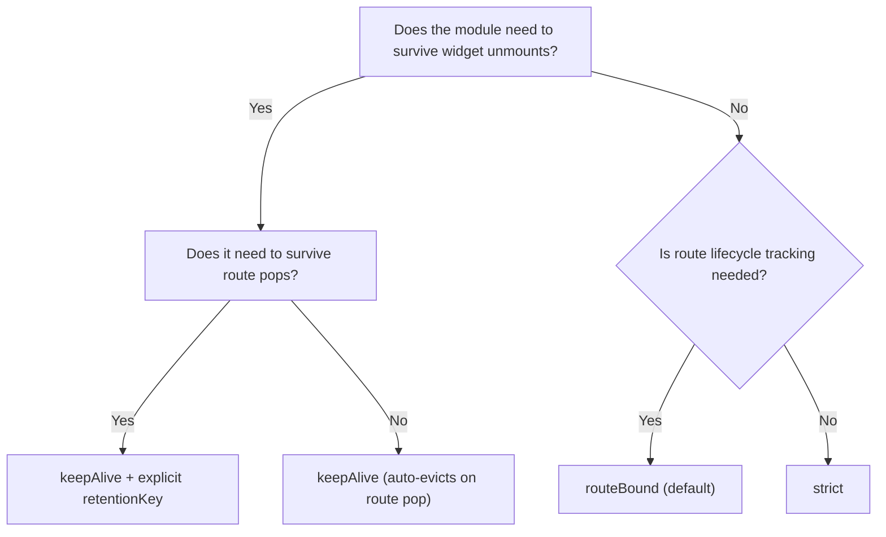

# Module Retention

`ModuleRetentionPolicy` controls when a `ModuleController` is disposed vs cached. Choose a policy based on how long the module's state should survive.

## Retention Policies

Every `ModuleScope` accepts a `retentionPolicy` parameter (defaults to `routeBound`):

| Policy | Disposed when | Caches across unmounts |
|--------|--------------|----------------------|
| `strict` | `ModuleScope` leaves widget tree | No |
| `routeBound` (default) | Route is popped or removed | No |
| `keepAlive` | All refs released or route terminates | Yes |

### strict

Dispose the controller the moment `ModuleScope` leaves the widget tree. No caching, no route observation. One widget mount = one controller lifetime.

```dart
ModuleScope(
  module: ConfirmationDialog(),
  retentionPolicy: ModuleRetentionPolicy.strict,
  child: const DialogContent(),
)
```

Use for: one-shot screens, dialogs, bottom sheets, widgets that must never share state.

### routeBound (Default)

The controller lives as long as the enclosing `ModalRoute`. Disposal happens on `didPop` or `didRemove`. Internally, `RouteBoundRetentionStrategy` mixes in `RouteAware` and subscribes to `Modularity.observer`.

```dart
ModuleScope(
  module: OrderDetailsModule(),
  // retentionPolicy: ModuleRetentionPolicy.routeBound, // default
  child: const OrderDetailsPage(),
)
```

::: warning RouteObserver required
`routeBound` requires `Modularity.observer` to be registered in your `MaterialApp`. Without it, route lifecycle events are not captured.

```dart
MaterialApp(
  navigatorObservers: [Modularity.observer],
  // ...
)
```
:::

Key behaviors:
- Widget unmount without route pop does **not** dispose the controller.
- Each mount creates a fresh controller -- no caching between mounts.
- If there is no enclosing `ModalRoute`, the strategy silently skips route subscription.

### keepAlive

The controller is registered in `ModuleRetainer` (held by `ModularityRoot`). When `ModuleScope` unmounts, the controller stays in the cache. When a new `ModuleScope` mounts with the same retention key, it reuses the cached controller via `acquire()`.

```dart
ModuleScope(
  module: ProfileModule(),
  retentionPolicy: ModuleRetentionPolicy.keepAlive,
  retentionKey: 'profile-${user.id}',
  child: const ProfileView(),
)
```

The controller is disposed when:

1. **Route terminates** -- `keepAlive` controllers track their enclosing route. When it pops, the controller is evicted via `route.popped` listener.
2. **Explicit eviction** -- call `ModuleRetainer.evict(key)` to force removal regardless of ref count.

On `ModuleScope` unmount, `release()` decrements the ref count but does **not** dispose the controller. The controller survives in the cache until route termination or explicit eviction.

## Retention Key

A retention key uniquely identifies a cached controller within `ModuleRetainer`. Two `ModuleScope` widgets with the same key and `keepAlive` policy share the same controller.

### Automatic Key Derivation

When `retentionKey` is not provided, the framework computes one from:

| Input | Source |
|-------|--------|
| Module type | `module.runtimeType` |
| Route name | `ModalRoute.of(context).settings.name` |
| Arguments hash | Stable hash of `args` passed to `ModuleScope` |
| Parent key | Inherited from nearest ancestor `ModuleScope` via `_RetentionKeyScope` |
| Extras | `retentionExtras` map on `ModuleScope` |

All inputs are combined via `Object.hashAll`. This is sufficient when each route has at most one instance of a given module type.

### Explicit Key

For dynamic scenarios (e.g. multiple chat rooms on one screen), provide an explicit key:

```dart
ModuleScope(
  module: ChatModule(),
  retentionPolicy: ModuleRetentionPolicy.keepAlive,
  retentionKey: 'chat-room-$roomId',
  child: const ChatView(),
)
```

### Custom Key via RetentionIdentityProvider

A module can compute its own key by mixing in `RetentionIdentityProvider`:

```dart
class ChatModule extends Module with RetentionIdentityProvider {
  final String roomId;
  ChatModule(this.roomId);

  @override
  Object? buildRetentionIdentity(ModuleRetentionContext context) {
    return 'chat-room-$roomId';
  }

  @override
  void binds(Binder i) { /* ... */ }
}
```

Returning `null` falls back to the default derivation.

### Retention Key vs Override Scope

::: warning
`retentionKey` and `overrideScope` are independent concepts.

- **retentionKey** determines cache identity in `ModuleRetainer`.
- **overrideScope** affects DI bindings but does **not** affect cache identity.

Two scopes with the same key but different override scopes **share** the cached controller -- the first scope's overrides win. To make overrides affect caching, include the scope identity in the key:

```dart
ModuleScope(
  module: MyModule(),
  retentionPolicy: ModuleRetentionPolicy.keepAlive,
  retentionKey: 'my-module-${identityHashCode(overrideScope)}',
  overrideScope: overrideScope,
  child: child,
)
```
:::

See [Dependency Overrides](./dependency-overrides.md) for details on `ModuleOverrideScope`.

## Decision Flowchart



## ModuleRetainer API

`ModuleRetainer` is stored in `ModularityRoot` and manages the `keepAlive` cache. Access it via `ModularityRoot.retainerOf(context)`.

| Method | Description |
|--------|-------------|
| `contains(key)` | Check if a controller is cached under `key` |
| `acquire(key)` | Increment ref count and return the controller, or `null` |
| `peek(key)` | Return the controller without changing ref count |
| `register(key, controller, ...)` | Store a new controller with initial ref count |
| `release(key, {disposeIfOrphaned})` | Decrement ref count; optionally dispose if orphaned |
| `evict(key, {disposeController})` | Remove and optionally dispose regardless of ref count |
| `debugSnapshot()` | List all entries as `ModuleRetainerEntrySnapshot` |

You typically do not call these directly -- `ModuleScope` manages them through retention strategies.

## Debugging

Inspect cached modules at runtime:

```dart
final retainer = ModularityRoot.retainerOf(context);
for (final entry in retainer.debugSnapshot()) {
  debugPrint(
    '${entry.moduleType} key=${entry.key} '
    'refs=${entry.refCount} policy=${entry.policy.name}',
  );
}
```

Enable lifecycle logging to trace retention events:

```dart
Modularity.enableDebugLogging();
// Output:
// [Modularity] CREATED ProfileModule key=12345678
// [Modularity] REGISTERED ProfileModule key=12345678 {policy: keepAlive, refCount: 1}
// [Modularity] REUSED ProfileModule key=12345678 {refCount: 2}
// [Modularity] RELEASED ProfileModule key=12345678 {refCount: 1}
```

## Common Pitfalls

- **Forgot `Modularity.observer`** -- `routeBound` silently skips route subscription if there is no enclosing `ModalRoute`. The controller will only dispose when `ModuleScope` is removed from the tree, not on route pop.
- **Changing policy at runtime** -- An assertion fires in debug mode. Create a new `ModuleScope` instance instead.
- **Changing retentionKey at runtime** -- Same assertion. The key is fixed at first build.
- **Same retentionKey + different overrideScope** -- The first scope's overrides win. Include scope identity in the key if you need override-aware caching.
- **keepAlive without route** -- If a `keepAlive` module is placed outside any `ModalRoute`, no automatic eviction occurs on route pop. Use explicit `evict()` or ensure the module lives within a routed context.

## FAQ

**When should I use `keepAlive` vs `routeBound`?**
Use `keepAlive` when the module must survive tab switches or widget rebuilds within the same navigation context. Use `routeBound` when the module's lifetime should match navigation (push = create, pop = dispose).

**Can I force-dispose a `keepAlive` module?**
Yes. Call `ModuleRetainer.evict(key)`. Alternatively, navigate away so the route terminates and the retainer auto-evicts.

**What happens to `keepAlive` controllers when their route pops?**
They are automatically evicted. The retainer attaches a `route.popped` listener that triggers cleanup.
