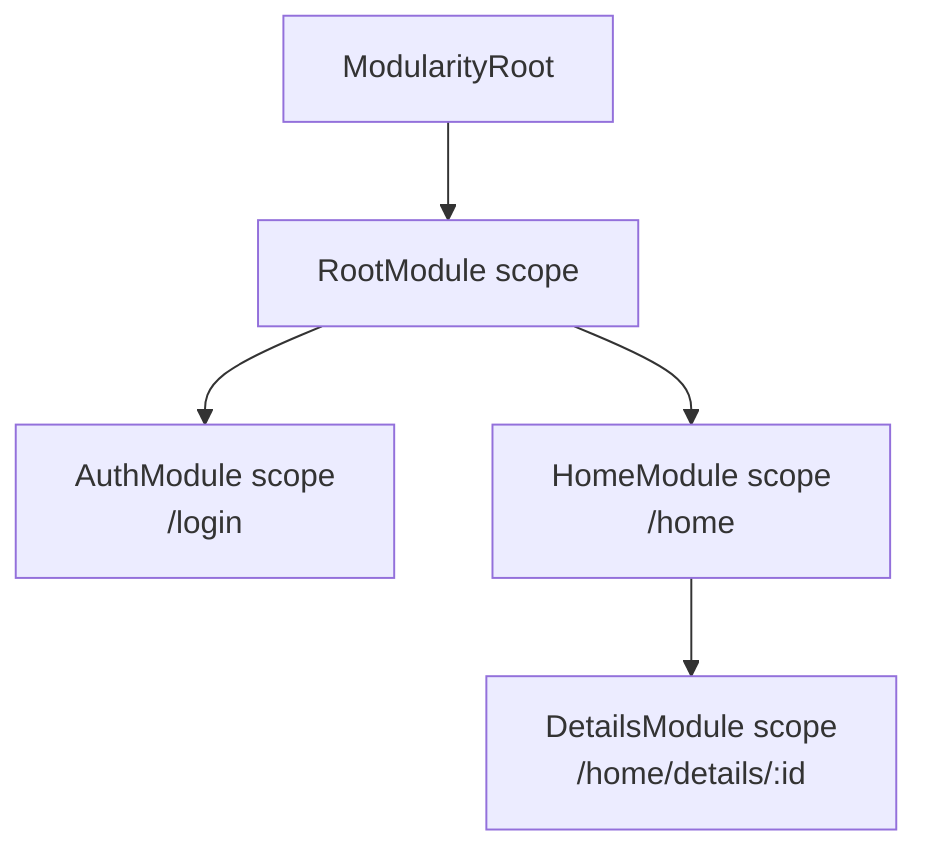
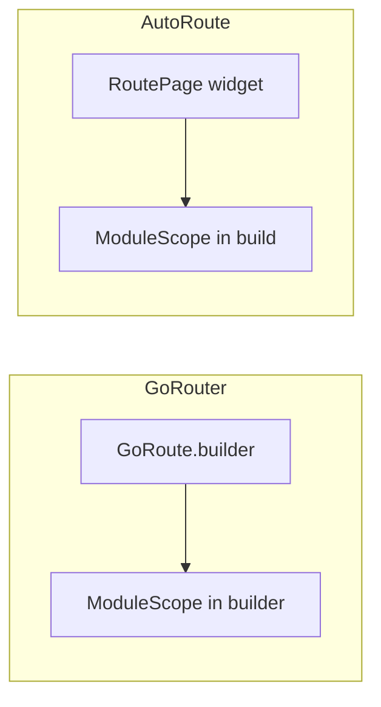

# 🧭 Routing Integration

Wrap each route in a `ModuleScope` so modules follow navigation lifecycle automatically. Modularity is router-agnostic -- the same pattern works with GoRouter, AutoRoute, or Navigator 1.0.

## Scope Nesting with Routes



## Core Pattern

One route = one `ModuleScope`. The scope creates a `ModuleController`, runs `binds()` / `exports()` / `onInit()`, and disposes the controller when the route is removed.

```dart
ModuleScope(
  module: ProfileModule(),
  child: const ProfilePage(),
)
```

`ModuleScope` handles:
- Creating a `Binder` scoped to this module
- Running `binds()` / `exports()` / `onInit()`
- Disposing the controller when the route leaves the stack

### Scope Chaining

::: info
Nested `ModuleScope` widgets form a parent-child chain. Child scopes can resolve dependencies registered by any ancestor scope via `get<T>()`:

```
ModularityRoot
  └── ModuleScope<RootModule>       <- registers AuthService
        └── MaterialApp.router
              └── ModuleScope<HomeModule>  <- get<AuthService>() resolves from parent
```
:::

### Configurable Modules

Pass route parameters into modules using the `Configurable<T>` interface and the `args` parameter:

```dart
class DetailsModule extends Module implements Configurable<String> {
  late String id;

  @override
  void configure(String args) {
    id = args;
  }

  @override
  void binds(Binder i) {
    // id is available here -- configure() runs before binds()
  }
}
```

```dart
ModuleScope(
  module: DetailsModule(),
  args: routeParams['id'],
  child: const DetailsPage(),
)
```

### Expected Dependencies

Declare parent dependencies a module requires with `expects`. Initialization fails fast if a listed type is missing from the parent scope:

```dart
class SettingsModule extends Module {
  @override
  List<Type> get expects => [AuthService];

  @override
  void binds(Binder i) {}
}
```

## Observer Registration

`Modularity.observer` is a `RouteObserver` that powers the default `routeBound` retention policy. Register it with your router so module controllers dispose when their route is popped.

For classic `MaterialApp`:

```dart
MaterialApp(
  navigatorObservers: [Modularity.observer],
  home: ...,
)
```

::: warning
Without `Modularity.observer`, `routeBound` retention cannot detect route pops. Controllers will only dispose when the widget itself is unmounted. Always register the observer at the app level.
:::

## GoRouter vs AutoRoute Integration Points



## App Setup

::: code-group

```dart [GoRouter]
void main() => runApp(const MyApp());

class MyApp extends StatelessWidget {
  const MyApp({super.key});

  @override
  Widget build(BuildContext context) {
    return ModularityRoot(
      child: ModuleScope(
        module: RootModule(),
        child: Builder(
          builder: (context) {
            return MaterialApp.router(
              routerConfig: AppRouter.router,
            );
          },
        ),
      ),
    );
  }
}
```

```dart [AutoRoute]
class MyApp extends StatelessWidget {
  const MyApp({super.key});

  @override
  Widget build(BuildContext context) {
    return ModularityRoot(
      child: ModuleScope(
        module: RootModule(),
        child: Builder(
          builder: (context) {
            final authService =
                ModuleProvider.of(context).get<AuthService>();
            final appRouter = AppRouter(authService);

            return MaterialApp.router(
              routerConfig: appRouter.config(
                navigatorObservers: () => [Modularity.observer],
              ),
            );
          },
        ),
      ),
    );
  }
}
```

:::

`RootModule` sits above the router so every route inherits its dependencies through scope chaining. The `Builder` creates a context that already has access to `RootModule` dependencies.

AutoRoute passes resolved dependencies into the router constructor so guards can use them, and registers the observer through `config(navigatorObservers: ...)` rather than the `MaterialApp` constructor.

## GoRouter

### Route Definitions

Wrap the `builder` return value in a `ModuleScope`:

```dart
final router = GoRouter(
  initialLocation: '/home',
  observers: [Modularity.observer],
  routes: [
    GoRoute(
      path: '/login',
      builder: (context, state) => ModuleScope(
        module: AuthModule(),
        child: const AuthPage(),
      ),
    ),
    GoRoute(
      path: '/home',
      builder: (context, state) => ModuleScope(
        module: HomeModule(),
        child: const HomePage(),
      ),
      routes: [
        GoRoute(
          path: 'details/:id',
          builder: (context, state) {
            final id = state.pathParameters['id']!;
            return ModuleScope(
              module: DetailsModule(),
              args: id,
              child: DetailsPage(id: id),
            );
          },
        ),
      ],
    ),
  ],
);
```

### ShellRoute (Tab Layout)

A `ShellRoute` keeps a shared layout alive while child routes swap. Wrap the shell builder in its own `ModuleScope`:

```dart
ShellRoute(
  builder: (context, state, child) {
    return ModuleScope(
      module: DashboardModule(),
      child: DashboardPage(child: child),
    );
  },
  routes: [
    GoRoute(
      path: '/home',
      builder: (context, state) => ModuleScope(
        module: HomeModule(),
        child: const HomePage(),
      ),
    ),
    GoRoute(
      path: '/settings',
      builder: (context, state) => ModuleScope(
        module: SettingsModule(),
        child: const SettingsPage(),
      ),
    ),
  ],
)
```

`DashboardModule`'s scope becomes the parent for `HomeModule` and `SettingsModule`. Dependencies registered in the dashboard are available to both child scopes.

### Redirect with ModuleProvider

Access dependencies registered by an ancestor `ModuleScope` inside `redirect`:

```dart
GoRouter(
  redirect: (BuildContext context, GoRouterState state) {
    try {
      final authService =
          ModuleProvider.of(context).get<AuthService>();
      final isLoggedIn = authService.isLoggedIn;
      final isLoggingIn = state.uri.path == '/login';

      if (!isLoggedIn && !isLoggingIn) return '/login';
      if (isLoggedIn && isLoggingIn) return '/home';
    } catch (_) {
      // AuthService not yet available during first build
    }
    return null;
  },
  // ...
);
```

::: tip
The `redirect` callback receives a `BuildContext` that sits below `ModularityRoot` and the root `ModuleScope`. This is why the `Builder` wrapper in the app setup is important -- it creates a context that already has access to `RootModule` dependencies.
:::

## AutoRoute

### Route Pages with ModuleScope

With AutoRoute, wrap `ModuleScope` inside `@RoutePage()` widgets:

```dart
@RoutePage()
class HomePage extends StatelessWidget {
  const HomePage({super.key});

  @override
  Widget build(BuildContext context) {
    return ModuleScope(
      module: HomeModule(),
      child: Scaffold(
        appBar: AppBar(title: const Text('Home')),
        body: const HomeContent(),
      ),
    );
  }
}
```

::: tip
Co-locate `ModuleScope` with its route page. Place it inside the page widget rather than in route configuration so module ownership stays next to the page that uses it.
:::

### Router Configuration and Guards

```dart
@AutoRouterConfig()
class AppRouter extends RootStackRouter {
  AppRouter(this.authService);
  final AuthService authService;

  @override
  List<AutoRoute> get routes => [
    AutoRoute(page: AuthRoute.page, path: '/login'),
    AutoRoute(
      page: DashboardRoute.page,
      path: '/',
      guards: [AuthGuard(authService)],
      children: [
        AutoRoute(page: HomeRoute.page, path: 'home'),
        AutoRoute(page: SettingsRoute.page, path: 'settings'),
      ],
    ),
    AutoRoute(
      page: DetailsRoute.page,
      path: '/details/:id',
      guards: [AuthGuard(authService)],
    ),
  ];
}

class AuthGuard extends AutoRouteGuard {
  AuthGuard(this.authService);
  final AuthService authService;

  @override
  void onNavigation(NavigationResolver resolver, StackRouter router) {
    if (authService.isLoggedIn) {
      resolver.next(true);
    } else {
      router.push(const AuthRoute());
    }
  }
}
```

The guard receives `AuthService` from the root scope at router creation time.

### Tab Navigation

Use `AutoTabsScaffold` inside a `ModuleScope` for tabbed layouts:

```dart
@RoutePage()
class DashboardPage extends StatelessWidget {
  const DashboardPage({super.key});

  @override
  Widget build(BuildContext context) {
    return ModuleScope(
      module: DashboardModule(),
      child: AutoTabsScaffold(
        routes: const [HomeRoute(), SettingsRoute()],
        bottomNavigationBuilder: (_, tabsRouter) {
          return BottomNavigationBar(
            currentIndex: tabsRouter.activeIndex,
            onTap: tabsRouter.setActiveIndex,
            items: const [
              BottomNavigationBarItem(
                icon: Icon(Icons.home), label: 'Home',
              ),
              BottomNavigationBarItem(
                icon: Icon(Icons.settings), label: 'Settings',
              ),
            ],
          );
        },
      ),
    );
  }
}
```

### Configurable Route Pages

Pass path parameters via `args`:

```dart
@RoutePage()
class DetailsPage extends StatelessWidget {
  const DetailsPage({required this.id});
  final String id;

  @override
  Widget build(BuildContext context) {
    return ModuleScope(
      module: DetailsModule(),
      args: id,
      child: Scaffold(
        appBar: AppBar(title: Text('Details $id')),
        body: const DetailsContent(),
      ),
    );
  }
}
```

## Retention Policies

`ModuleScope` defaults to `ModuleRetentionPolicy.routeBound`. Three policies are available:

| Policy | Behaviour |
|--------|-----------|
| `routeBound` (default) | Controller disposed when the route pops. |
| `strict` | Controller disposed on every widget unmount. |
| `keepAlive` | Controller cached in `ModuleRetainer`, survives widget unmount. |

```dart
ModuleScope(
  module: ExpensiveModule(),
  retentionPolicy: ModuleRetentionPolicy.keepAlive,
  retentionKey: 'expensive-module',
  child: const ExpensivePage(),
)
```

::: tip
Use `keepAlive` for modules with expensive initialization (network calls, database setup). Use `strict` for modules that must reinitialize on every visit.
:::

### Retention Key for Route Parameters

When the same module type is used on different routes with different parameters, set a `retentionKey` to avoid cache collisions:

```dart
GoRoute(
  path: '/users/:id',
  builder: (context, state) {
    final userId = state.pathParameters['id']!;
    return ModuleScope(
      module: UserModule(),
      args: userId,
      retentionPolicy: ModuleRetentionPolicy.keepAlive,
      retentionKey: 'user-$userId',
      child: const UserPage(),
    );
  },
)
```

Without an explicit key, the identity is derived from `(moduleType, route, args)`. Set `retentionKey` when you need deterministic cache identity independent of route metadata.

::: warning
`overrideScope` does **not** affect the retention key. Two scopes with the same key but different overrides share one cached controller. Include override identity in the key if needed.
:::

## Loading and Error States

`ModuleScope` renders loading/error UI while the module initializes. Use per-scope builders or fall back to `ModularityRoot` defaults:

```dart
ModuleScope(
  module: PaymentModule(),
  loadingBuilder: (_) => const PaymentSkeleton(),
  errorBuilder: (_, error, retry) => PaymentErrorView(
    message: error.toString(),
    onRetry: retry,
  ),
  child: const PaymentPage(),
)
```

Fallback order: scope builder -> `ModularityRoot` defaults -> built-in placeholder.

## Debug Logging

Enable lifecycle logging during development to trace module creation and disposal:

```dart
void main() {
  Modularity.enableDebugLogging();
  runApp(const MyApp());
}
```

Output:

```
[Modularity] CREATED HomeModule key=HomeModule@/home
[Modularity] DISPOSED HomeModule key=HomeModule@/home
```

## Checklist

- `ModularityRoot` is the topmost widget
- `Modularity.observer` is registered with the router
- Each route has its own `ModuleScope`
- Root-level services live in a `RootModule` above the router
- Route params are passed via `args` + `Configurable<T>`
- Modules declare `expects` for parent dependencies they require

| Concern | Solution |
|---------|----------|
| Per-route DI scope | Wrap page content in `ModuleScope` |
| Route parameters | `Configurable<T>` + `ModuleScope.args` |
| Route-aware disposal | `Modularity.observer` + `routeBound` policy |
| Cross-tab caching | `keepAlive` policy + `retentionKey` |
| Scope chaining | Nested `ModuleScope` widgets |
| GoRouter | Pass observer to `GoRouter(observers: [...])` |
| AutoRoute | Pass observer to `appRouter.config(navigatorObservers: ...)` |
