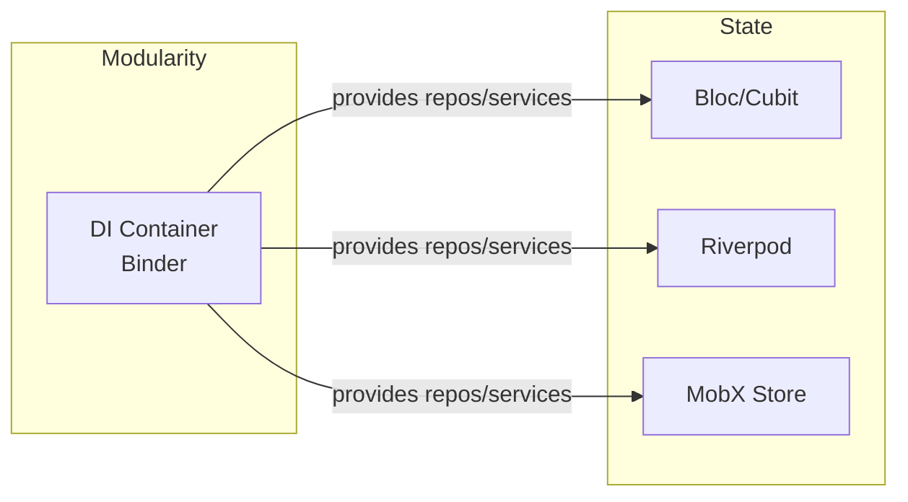
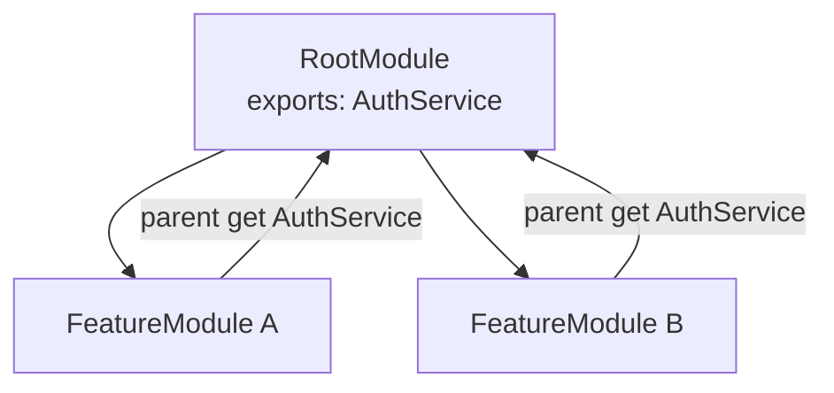

# State Management Integration

Modularity handles **DI and lifecycle**. State management libraries handle **reactivity**. They compose cleanly: register reactive objects in `binds()`, resolve them via `ModuleProvider.of(context)`, and feed them to whichever state management solution your app uses.

## Core Principle



The pattern is always the same:

1. Register state objects (Cubits, Stores, Notifiers) in `Module.binds()`.
2. Resolve them via `ModuleProvider.of(context).get<T>()`.
3. Feed them into the state management library's provider or observer widget.

`ModuleScope` creates and disposes the DI scope. Inside that scope, use `BlocProvider`, `ProviderScope`, `Observer`, or any other mechanism to wire reactive state to the widget tree.

::: warning
Do not manage DI container state with your state management library. Modularity owns object creation, scoping, and disposal. The state management library owns reactivity and UI rebuilds. Mixing these responsibilities leads to lifecycle bugs and memory leaks.
:::

## Registration Patterns

All three libraries follow the same registration flow. The only difference is the bridge widget used to connect the resolved instance to the UI.

::: code-group

```dart [Bloc/Cubit]
class CounterModule extends Module {
  @override
  void binds(Binder i) {
    i.registerFactory<CounterCubit>(() => CounterCubit());
  }
}
```

```dart [Riverpod]
class CounterModule extends Module {
  @override
  void binds(Binder i) {
    i.registerLazySingleton<AuthService>(
      () => AuthService('api-token'),
    );
  }
}
```

```dart [MobX]
class RootModule extends Module {
  @override
  void binds(Binder i) {
    i.registerLazySingleton<AuthStore>(() => AuthStore());
    i.registerLazySingleton<CartStore>(() => CartStore());
  }
}
```

:::

## Bloc / Cubit

### Register in binds()

Register Blocs or Cubits in the module's `binds()` method. Use `registerFactory` if each consumer needs a fresh instance, or `registerLazySingleton` to share one across the scope:

```dart
class CounterModule extends Module {
  @override
  void binds(Binder i) {
    i.registerFactory<CounterCubit>(() => CounterCubit());
  }
}
```

### Resolve and Provide

Resolve the Cubit from `ModuleProvider` and hand it to `BlocProvider`:

```dart
class CounterPage extends StatelessWidget {
  const CounterPage({super.key});

  @override
  Widget build(BuildContext context) {
    return BlocProvider(
      create: (context) => ModuleProvider.of(
        context,
        listen: false,
      ).get<CounterCubit>(),
      child: const CounterView(),
    );
  }
}
```

`listen: false` avoids rebuilding `CounterPage` when the binder changes. `BlocProvider` owns the Cubit lifecycle from this point -- but the Cubit's *dependencies* are managed by Modularity.

### Consume Normally

Below `BlocProvider`, use `BlocBuilder` and `context.read<T>()` as usual:

```dart
class CounterView extends StatelessWidget {
  const CounterView({super.key});

  @override
  Widget build(BuildContext context) {
    return Scaffold(
      body: Center(
        child: BlocBuilder<CounterCubit, int>(
          builder: (context, count) => Text('Count: $count'),
        ),
      ),
      floatingActionButton: FloatingActionButton(
        onPressed: () => context.read<CounterCubit>().increment(),
        child: const Icon(Icons.add),
      ),
    );
  }
}
```

### App Wiring

```dart
class MyApp extends StatelessWidget {
  const MyApp({super.key});

  @override
  Widget build(BuildContext context) {
    return ModularityRoot(
      child: MaterialApp(
        navigatorObservers: [Modularity.observer],
        home: ModuleScope(
          module: CounterModule(),
          child: const CounterPage(),
        ),
      ),
    );
  }
}
```

### Bloc with Dependencies

When a Bloc needs injected services, register them in `binds()` and resolve inside the factory:

```dart
class OrderModule extends Module {
  @override
  List<Type> get expects => [AuthService];

  @override
  void binds(Binder i) {
    i.registerLazySingleton<OrderRepository>(
      () => OrderRepositoryImpl(),
    );
    i.registerFactory<OrderCubit>(
      () => OrderCubit(
        repository: i.get<OrderRepository>(),
        auth: i.get<AuthService>(),
      ),
    );
  }
}
```

::: tip
`expects` declares that `AuthService` must exist in a parent scope. This fails fast during initialization if the dependency is missing.
:::

### Multi-Bloc Module

A single module can register multiple Cubits/Blocs:

```dart
class DashboardModule extends Module {
  @override
  void binds(Binder i) {
    i.registerLazySingleton<UserCubit>(
      () => UserCubit(i.get<UserRepository>()),
    );
    i.registerLazySingleton<NotificationCubit>(
      () => NotificationCubit(i.get<NotificationService>()),
    );
  }
}
```

Provide them to the tree with `MultiBlocProvider`:

```dart
class DashboardPage extends StatelessWidget {
  const DashboardPage({super.key});

  @override
  Widget build(BuildContext context) {
    final binder = ModuleProvider.of(context, listen: false);
    return MultiBlocProvider(
      providers: [
        BlocProvider(create: (_) => binder.get<UserCubit>()),
        BlocProvider(create: (_) => binder.get<NotificationCubit>()),
      ],
      child: const DashboardView(),
    );
  }
}
```

### Bloc with Exports

Keep the repository private and only export the public-facing service:

```dart
class AuthModule extends Module {
  @override
  void binds(Binder i) {
    i.registerLazySingleton<AuthRepository>(() => AuthRepositoryImpl());
    i.registerLazySingleton<AuthBloc>(
      () => AuthBloc(i.get<AuthRepository>()),
    );
  }

  @override
  void exports(Binder i) {
    i.registerLazySingleton<AuthService>(
      () => AuthService(i.get<AuthRepository>()),
    );
  }
}
```

The repository is private to `AuthModule`. Only `AuthService` is exported to other modules.

## Riverpod

Riverpod manages its own dependency graph. The integration pattern is:

1. Register services in Modularity's `binds()`
2. Resolve them via `ModuleProvider.of(context)`
3. Override Riverpod providers with the resolved instances

### Define Providers with Placeholder

Create providers that throw by default -- they will be overridden at runtime:

```dart
final authServiceProvider = Provider<AuthService>((ref) {
  throw UnimplementedError('Override in ModuleScope');
});

final counterProvider = StateProvider<int>((ref) => 0);
```

### Module Registration

```dart
class CounterModule extends Module {
  @override
  void binds(Binder i) {
    i.registerLazySingleton<AuthService>(
      () => AuthService('api-token'),
    );
  }
}
```

### Bridge via ProviderScope.overrides

Resolve from the binder and inject into Riverpod:

```dart
class CounterPage extends StatelessWidget {
  const CounterPage({super.key});

  @override
  Widget build(BuildContext context) {
    final binder = ModuleProvider.of(context);
    final authService = binder.get<AuthService>();

    return ProviderScope(
      overrides: [
        authServiceProvider.overrideWithValue(authService),
      ],
      child: const CounterView(),
    );
  }
}
```

### Consume Normally

```dart
class CounterView extends ConsumerWidget {
  const CounterView({super.key});

  @override
  Widget build(BuildContext context, WidgetRef ref) {
    final count = ref.watch(counterProvider);
    final auth = ref.watch(authServiceProvider);

    return Scaffold(
      appBar: AppBar(title: Text('Token: ${auth.token}')),
      body: Center(child: Text('Count: $count')),
      floatingActionButton: FloatingActionButton(
        onPressed: () => ref.read(counterProvider.notifier).state++,
        child: const Icon(Icons.add),
      ),
    );
  }
}
```

::: warning
Place `ProviderScope` **inside** `ModuleScope` so the binder is available when overrides are built. If `ProviderScope` is above `ModuleScope`, `ModuleProvider.of(context)` will throw.
:::

::: tip
This pattern keeps Riverpod providers pure and testable -- they declare their dependency contract, and `ModuleScope` satisfies it at runtime through overrides. In tests, provide mocks directly without Modularity.
:::

## MobX

MobX stores are plain Dart objects with observables. Register them in `binds()` and resolve with `ModuleProvider.of(context)`. No extra provider widget is needed -- `Observer` from `flutter_mobx` rebuilds whenever any accessed observable changes.

### Register Stores in binds()

Register stores as singletons so the same reactive state is shared across the module:

```dart
class RootModule extends Module {
  @override
  void binds(Binder i) {
    i.registerLazySingleton<AuthStore>(() => AuthStore());
    i.registerLazySingleton<CartStore>(() => CartStore());
  }
}
```

### Resolve and Observe

Resolve stores from the binder and wrap reactive reads in `Observer`:

```dart
class LoginPage extends StatelessWidget {
  const LoginPage({super.key});

  @override
  Widget build(BuildContext context) {
    final authStore = ModuleProvider.of(context).get<AuthStore>();

    return Scaffold(
      body: Center(
        child: Observer(
          builder: (_) {
            if (authStore.isLoading) {
              return const CircularProgressIndicator();
            }
            return ElevatedButton(
              onPressed: () async {
                await authStore.login('user', 'password');
                if (context.mounted && authStore.isLoggedIn) {
                  Navigator.of(context).pushReplacement(
                    MaterialPageRoute(
                      builder: (_) => ModuleScope(
                        module: MainModule(),
                        child: const MainPage(),
                      ),
                    ),
                  );
                }
              },
              child: const Text('Login'),
            );
          },
        ),
      ),
    );
  }
}
```

### Stores with Module Dependencies

A store registered in a child module can depend on services from parent scopes:

```dart
class HomeModule extends Module {
  @override
  List<Type> get expects => [CartStore];

  @override
  void binds(Binder i) {
    i.registerLazySingleton<ProductStore>(() => ProductStore());
  }
}
```

In the page, resolve both the local and parent-scoped stores:

```dart
class HomePage extends StatefulWidget {
  const HomePage({super.key});

  @override
  State<HomePage> createState() => _HomePageState();
}

class _HomePageState extends State<HomePage> {
  late final ProductStore productStore;
  late final CartStore cartStore;

  @override
  void didChangeDependencies() {
    super.didChangeDependencies();
    final binder = ModuleProvider.of(context);
    productStore = binder.get<ProductStore>();
    cartStore = binder.get<CartStore>();
  }

  @override
  Widget build(BuildContext context) {
    return Observer(
      builder: (_) => ListView.builder(
        itemCount: productStore.products.length,
        itemBuilder: (context, index) {
          final product = productStore.products[index];
          return ListTile(
            title: Text(product.name),
            trailing: IconButton(
              icon: const Icon(Icons.add_shopping_cart),
              onPressed: () => cartStore.add(product),
            ),
          );
        },
      ),
    );
  }
}
```

`CartStore` is resolved from the parent `RootModule` scope. `ProductStore` is local to `HomeModule`.

::: tip
Resolve stores in `didChangeDependencies()` (not `initState()`) because `ModuleProvider.of(context)` depends on `InheritedWidget`, which is not available during `initState`.
:::

### Configurable Modules with MobX

Pass runtime data into a module that registers store-specific bindings:

```dart
class ProductDetailsModule extends Module
    implements Configurable<Product> {
  late Product _product;

  @override
  void configure(Product args) => _product = args;

  @override
  List<Type> get expects => [CartStore];

  @override
  void binds(Binder i) {
    i.registerLazySingleton<String>(
      () => 'Details for ${_product.name}',
    );
  }
}
```

Navigate and pass args via `ModuleScope.args`:

```dart
Navigator.of(context).push(
  MaterialPageRoute(
    builder: (_) => ModuleScope(
      module: ProductDetailsModule(),
      args: product,
      child: const ProductDetailsPage(),
    ),
  ),
);
```

## Cross-Module State Sharing

Share state across modules using **scope chaining**. Register shared state in a parent module and declare it in child modules via `expects`:



```
ModuleScope(RootModule)          <-- registers AuthStore, CartStore
  +-- ModuleScope(HomeModule)     <-- expects: [CartStore]
  +-- ModuleScope(CartModule)     <-- expects: [CartStore]
  +-- ModuleScope(SettingsModule) <-- expects: [AuthStore]
```

### Root Module

```dart
class RootModule extends Module {
  @override
  void binds(Binder i) {
    i.registerLazySingleton<AuthStore>(() => AuthStore());
    i.registerLazySingleton<CartStore>(() => CartStore());
  }
}
```

### Child Module

```dart
class CartModule extends Module {
  @override
  List<Type> get expects => [CartStore];

  @override
  void binds(Binder i) {
    // CartStore comes from parent, no need to register it
  }
}
```

Any child module can call `ModuleProvider.of(context).get<CartStore>()` and receive the same singleton instance registered in `RootModule`.

### Reading Parent Dependencies

`get<T>()` searches in this order: **private scope** (registrations from `binds()`) -> **imports** (exported registrations from imported modules) -> **parent scope**. Private registrations are checked first, so a local binding always shadows a parent binding of the same type.

If a child module also registers a `CartStore` locally and you need the parent's version:

```dart
final parentCart = ModuleProvider.of(context).parent<CartStore>();
```

### Exported Dependencies

For cross-module sharing between siblings (not parent-child), use `imports` and `exports()`. The key distinction: `binds()` writes to the module's **private scope** (only visible within the module itself), while `exports()` writes to the **public scope** (visible to any module that imports this one).

```dart
class AuthModule extends Module {
  @override
  void binds(Binder i) {
    // Private scope: only AuthModule can resolve this
    i.registerLazySingleton<AuthRepository>(
      () => AuthRepositoryImpl(),
    );
  }

  @override
  void exports(Binder i) {
    // Public scope: available to importing modules
    i.registerLazySingleton<AuthService>(
      () => AuthService(i.get<AuthRepository>()),
    );
  }
}
```

Modules that import `AuthModule` can resolve `AuthService` but not `AuthRepository`.

## Tab Navigation with Shared State

Tabs that need shared state from a parent module:

```dart
class MainModule extends Module {
  @override
  List<Type> get expects => [AuthStore, CartStore];

  @override
  void binds(Binder i) {}
}

class MainPage extends StatefulWidget {
  const MainPage({super.key});

  @override
  State<MainPage> createState() => _MainPageState();
}

class _MainPageState extends State<MainPage> {
  int _currentIndex = 0;

  @override
  Widget build(BuildContext context) {
    return Scaffold(
      body: IndexedStack(
        index: _currentIndex,
        children: [
          ModuleScope(module: HomeModule(), child: const HomePage()),
          ModuleScope(module: CartModule(), child: const CartPage()),
          ModuleScope(
            module: SettingsModule(),
            child: const SettingsPage(),
          ),
        ],
      ),
      bottomNavigationBar: BottomNavigationBar(
        currentIndex: _currentIndex,
        onTap: (index) => setState(() => _currentIndex = index),
        items: const [
          BottomNavigationBarItem(
            icon: Icon(Icons.home), label: 'Home',
          ),
          BottomNavigationBarItem(
            icon: Icon(Icons.shopping_cart), label: 'Cart',
          ),
          BottomNavigationBarItem(
            icon: Icon(Icons.settings), label: 'Settings',
          ),
        ],
      ),
    );
  }
}
```

Each tab has its own `ModuleScope` but shares `AuthStore` and `CartStore` from `RootModule` above.

## Choosing a Pattern

::: tip Best Practices
- **Bloc/Cubit** -- best for complex event-driven flows, built-in testing utilities, strong separation of events and states.
- **Riverpod** -- best when you already have a Riverpod codebase, or need fine-grained provider dependencies without `BuildContext`.
- **MobX** -- best for minimal boilerplate reactivity, especially if your team comes from a MobX/React background.

In all cases, let Modularity own object creation and scoping. The state library owns reactivity.
:::

::: info Comparison Table
| Scenario | Recommendation |
|----------|---------------|
| Simple app, few screens | Modularity only, no extra state lib |
| Complex reactive UI | Modularity + Bloc or MobX |
| Existing Riverpod codebase | Bridge pattern: Modularity DI into Riverpod providers |
| Cross-module shared state | Register in a parent `ModuleScope`, declare `expects` in children |
| Per-route ephemeral state | `registerFactory` in `binds()`, new instance each time |
| App-wide singleton | `registerLazySingleton` in root module's `binds()` |
:::

## Summary

::: info Integration Summary
| State Library | Register in | Bridge widget | Consume with |
|---------------|------------|---------------|-------------|
| Bloc/Cubit | `binds()` | `BlocProvider(create: binder.get)` | `BlocBuilder`, `context.read` |
| Riverpod | `binds()` | `ProviderScope(overrides: [...])` | `ref.watch`, `ref.read` |
| MobX | `binds()` | None needed | `Observer(builder: ...)` |
:::

All three follow the same flow:

1. Register in `binds()` (Modularity owns creation and disposal)
2. Resolve via `ModuleProvider.of(context).get<T>()`
3. Feed to the state management layer's own provider/observer

::: code-group

```dart [Bloc/Cubit]
// Register
i.registerFactory<CounterCubit>(() => CounterCubit());

// Bridge
BlocProvider(
  create: (_) => ModuleProvider.of(context, listen: false)
      .get<CounterCubit>(),
  child: const CounterView(),
);

// Consume
BlocBuilder<CounterCubit, int>(
  builder: (context, count) => Text('$count'),
);
```

```dart [Riverpod]
// Register
i.registerLazySingleton<AuthService>(() => AuthService());

// Bridge
ProviderScope(
  overrides: [
    authServiceProvider.overrideWithValue(
      ModuleProvider.of(context).get<AuthService>(),
    ),
  ],
  child: const CounterView(),
);

// Consume
final auth = ref.watch(authServiceProvider);
```

```dart [MobX]
// Register
i.registerLazySingleton<AuthStore>(() => AuthStore());

// Bridge: none needed

// Consume
Observer(
  builder: (_) => Text('${authStore.count}'),
);
```

:::

::: tip
Modularity does not replace your state management library. It manages *when* reactive objects are created and destroyed, scoped to module boundaries. Your chosen library handles *how* the UI reacts to state changes.
:::
