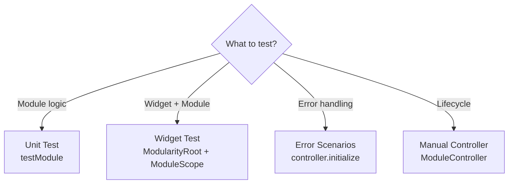

# Testing Modules

Test Modularity modules with `modularity_test` for unit tests and `ModuleScope` for widget tests.

## Choosing the Right Test Type



## Setup

```yaml
dev_dependencies:
  modularity_test:
    path: ../packages/modularity_test  # or published version
  test: ^1.25.0
```

## Unit Testing with `testModule()`

`testModule()` runs the full module lifecycle (resolve imports, binds, overrides, exports, onInit) and provides a `TestBinder` that records all registrations and resolutions. The controller is automatically disposed after the body runs.

```dart
import 'package:modularity_core/modularity_core.dart';
import 'package:modularity_test/modularity_test.dart';
import 'package:test/test.dart';

class AuthModule extends Module {
  @override
  void binds(Binder binder) {
    binder.registerLazySingleton<ApiClient>(() => ApiClient());
    binder.registerFactory<AuthRepository>(
      () => AuthRepository(binder.get<ApiClient>()),
    );
  }
}

test('AuthModule registers expected dependencies', () async {
  await testModule(AuthModule(), (module, binder) {
    expect(binder.hasSingleton<ApiClient>(), isTrue);
    expect(binder.hasFactory<AuthRepository>(), isTrue);

    final repo = binder.get<AuthRepository>();
    expect(repo, isA<AuthRepository>());
    expect(binder.wasResolved<AuthRepository>(), isTrue);
  });
});
```

### TestBinder API

::: info TestBinder reference
| Method | Description |
|--------|-------------|
| `hasSingleton<T>()` | Was `T` registered via `registerLazySingleton`? |
| `hasFactory<T>()` | Was `T` registered via `registerFactory`? |
| `hasInstance<T>()` | Was `T` registered via `registerSingleton` (eager)? |
| `wasResolved<T>()` | Was `T` retrieved via `get` or `tryGet`? |
| `registeredSingletons` | All types registered as lazy singletons |
| `registeredFactories` | All types registered as factories |
| `registeredInstances` | All types registered as eager instances |
| `resolvedTypes` | All types that were resolved |
:::

## Overriding Dependencies in Tests

Pass `overrides` to replace real implementations with fakes:

```dart
test('override HttpClient with fake', () async {
  await testModule(
    NetworkModule(),
    overrides: (binder) {
      binder.registerSingleton<HttpClient>(FakeHttpClient());
    },
    (module, binder) {
      expect(binder.get<HttpClient>(), isA<FakeHttpClient>());
    },
  );
});
```

::: tip
Use `overrideScope` when you need to override bindings in deeply nested imported modules. It lets you target specific child modules without affecting the rest of the dependency tree.
:::

For modules with imports, use `overrideScope` to target specific child modules:

```dart
test('override imported module bindings', () async {
  await testModule(
    AppModule(),
    overrideScope: ModuleOverrideScope(
      children: {
        DataModule: ModuleOverrideScope(
          selfOverrides: (binder) {
            binder.registerLazySingleton<DatabaseService>(
              () => FakeDatabaseService(),
            );
          },
        ),
      },
    ),
    (module, binder) {
      expect(binder.get<DatabaseService>().name, equals('fake'));
    },
  );
});
```

## Widget Testing

Wrap widgets in `ModularityRoot` + `ModuleScope`:

```dart
testWidgets('ProfilePage shows user name', (tester) async {
  await tester.pumpWidget(
    ModularityRoot(
      child: MaterialApp(
        home: ModuleScope(
          module: ProfileModule(),
          overrides: (binder) {
            binder.registerLazySingleton<UserService>(
              () => FakeUserService(),
            );
          },
          child: const ProfilePage(),
        ),
      ),
    ),
  );

  await tester.pumpAndSettle();
  expect(find.text('Test User'), findsOneWidget);
});
```

### Override scopes in widget tests

```dart
testWidgets('override imported module in widget tree', (tester) async {
  await tester.pumpWidget(
    ModularityRoot(
      child: MaterialApp(
        home: ModuleScope(
          module: AppModule(),
          overrideScope: ModuleOverrideScope(
            children: {
              AuthModule: ModuleOverrideScope(
                selfOverrides: (binder) {
                  binder.registerLazySingleton<AuthService>(
                    () => FakeAuthService(),
                  );
                },
              ),
            },
          ),
          child: const AppPage(),
        ),
      ),
    ),
  );

  await tester.pumpAndSettle();
  expect(find.text('Logged in as: test-user'), findsOneWidget);
});
```

## Testing Error Scenarios

::: details Error Scenarios (advanced)

### Circular dependency detection

```dart
test('circular imports throw CircularDependencyException', () async {
  final controller = ModuleController(ModuleA()); // A imports B, B imports A

  await expectLater(
    () => controller.initialize(<ModuleRegistryKey, ModuleController>{}),
    throwsA(isA<CircularDependencyException>()),
  );
});
```

### Missing `expects` validation

```dart
test('missing expects throw ModuleConfigurationException', () async {
  final controller = ModuleController(StrictModule()); // expects [AuthService]

  await expectLater(
    () => controller.initialize(<ModuleRegistryKey, ModuleController>{}),
    throwsA(isA<ModuleConfigurationException>()),
  );
});
```

### Error recovery in widgets

```dart
testWidgets('retry recovers from init failure', (tester) async {
  FlakyModule.attempts = 0;

  await tester.pumpWidget(
    ModularityRoot(
      child: MaterialApp(
        home: ModuleScope(
          module: FlakyModule(), // throws on first attempt
          child: const Text('Success'),
        ),
      ),
    ),
  );

  await tester.pump(const Duration(milliseconds: 100));
  expect(find.text('Module Init Failed'), findsOneWidget);

  await tester.tap(find.text('Retry'));
  await tester.pumpAndSettle();
  expect(find.text('Success'), findsOneWidget);
});
```

:::

## Testing Async `onInit`

`testModule()` awaits the full lifecycle including `onInit()`:

```dart
test('onInit completes before test body', () async {
  await testModule(CacheModule(), (module, binder) {
    expect(module.initialized, isTrue); // set in async onInit()
  });
});
```

## Manual Controller Tests

For tests that need direct `ModuleController` access, always dispose manually:

```dart
test('manual controller lifecycle', () async {
  final controller = ModuleController(MyModule());

  await controller.initialize(<ModuleRegistryKey, ModuleController>{});
  // ... assertions ...

  await controller.dispose();
  expect(controller.currentStatus, equals(ModuleStatus.disposed));
});
```

::: warning
`testModule()` automatically disposes the controller. Only create `ModuleController` directly when you need to test lifecycle states or interceptor behavior.
:::
