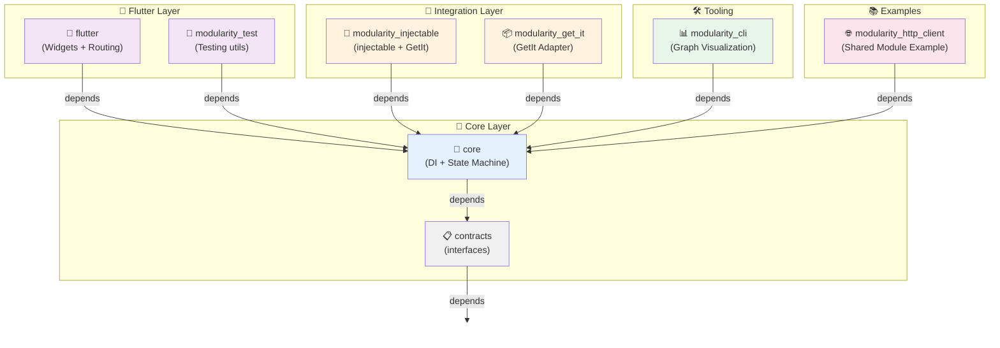
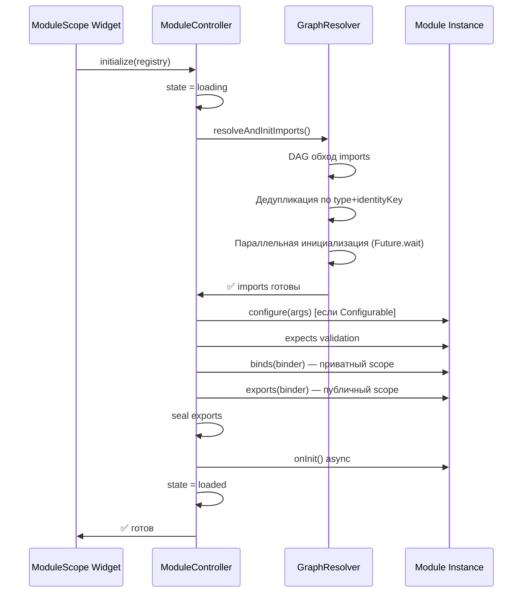
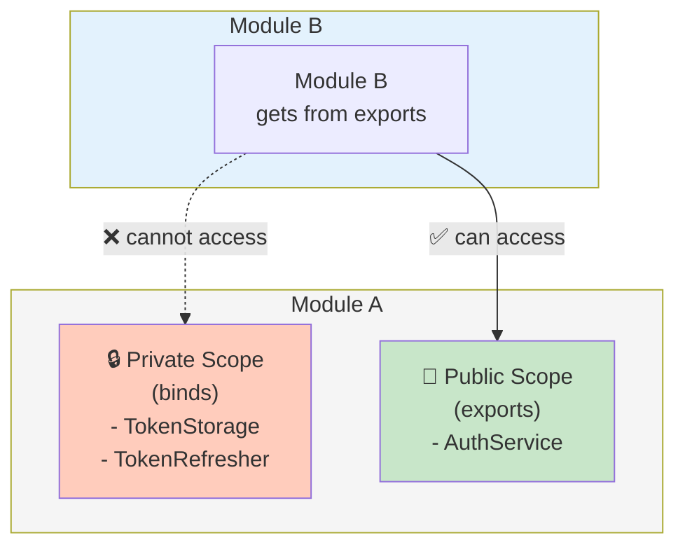

# 🏛️ Архитектура Modularity Framework

Высокоуровневая структура проекта, организация пакетов и правила зависимостей.

> Этот документ на русском. English docs: see `docs-site/`.

## Структура рабочего пространства

```
modularity/
├── packages/
│   ├── contracts/              # Интерфейсы (ноль зависимостей)
│   ├── core/                   # DI контейнер и state machine
│   ├── flutter/                # Flutter виджеты и интеграция с маршрутизацией
│   ├── modularity_test/        # Утилиты для модульного тестирования
│   ├── modularity_cli/         # Визуализация графов зависимостей
│   ├── modularity_injectable/  # Интеграция с injectable + GetIt
│   ├── adapters/
│   │   └── modularity_get_it/  # Standalone адаптер для GetIt
│   ├── shared_modules/
│   │   └── modularity_http_client/  # Пример переиспользуемого модуля
│   └── test_utils/             # Утилиты для внутреннего тестирования
├── docs/                       # Документация пользователя
├── docs-site/                  # VitePress сайт документации
└── pubspec.yaml                # Workspace корень
```

## Граф зависимостей пакетов



## Описание ключевых пакетов

### 1. **contracts** — Интерфейсы фреймворка
- Ноль зависимостей (zero-dependency contracts)
- Определяет основные интерфейсы:
  - `Module` — базовый класс модуля
  - `Binder` — интерфейс регистрации зависимостей
  - `ExportableBinder` — разделение на публичный/приватный scope
  - `Configurable<T>` — интерфейс конфигурируемых модулей
- Исключения: `ModularityException`, `DependencyNotFoundException`, `CircularDependencyException` и др.

### 2. **core** — Ядро фреймворка
Зависит от: `contracts`

- `SimpleBinder` — реализация DI контейнера
  - Управление регистрацией (singleton, lazy singleton, factory)
  - Поиск типов в локальном scope → imports → parent scope
- `ModuleController` — state machine модуля
  - Состояния: `initial` → `loading` → `loaded` → `disposed`
  - Координирует инициализацию и утилизацию
- `GraphResolver` — параллельное разрешение зависимостей
  - DAG обхода import'ов
  - Дедупликация модулей по типу + identityKey
  - Обнаружение циклических зависимостей

### 3. **flutter** — Flutter интеграция
Зависит от: `core`, `contracts`

- `ModularityRoot` — корневой виджет приложения
  - Инициализирует RouteObserver для обнаружения утилизации маршрутов
  - Регистрирует глобальные перехватчики (interceptors)
  - Настраивает default loading/error builders
- `ModuleScope<T>` — контекстный провайдер модуля
  - Инициализирует модуль при монтировании
  - Предоставляет Binder через `ModuleProvider.of(context)`
  - Поддерживает retention policies: `routeBound`, `keepAlive`, `strict`
- `ModuleProvider` — доступ к зависимостям из UI
- Retention system — кэширование модулей по политикам

### 4. **modularity_test** — Модульное тестирование
Зависит от: `core`, `contracts`

- `testModule(...)` — функция для изолированного тестирования
  - Инициализирует модуль без Flutter контекста
  - Предоставляет Binder для assertions
  - Поддерживает `ModuleOverrideScope` для mocking

### 5. **modularity_cli** — Визуализация и анализ
Зависит от: `core`, `contracts`

- `GraphVisualizer` — интерактивная визуализация графа
  - Анализирует `binds()`, `exports()`, `imports`, `submodules`
  - Поддерживает Graphviz (статический) и AntV G6 (интерактивный) рендеры
- `ModuleBindingsAnalyzer` — анализ регистраций модуля

### 6. **modularity_injectable** — Интеграция с injectable
Зависит от: `core`, `contracts`

- `GetItBinder` — адаптер на основе GetIt для injectable
- `ModularityInjectableBridge` — мостик между `@injectable` аннотациями и Modularity
- Позволяет использовать code generation вместо ручной регистрации

### 7. **adapters/modularity_get_it** — Standalone GetIt адаптер
Зависит от: `core`, `contracts`

- `GetItBinderFactory` — фабрика для использования GetIt как DI контейнера
  - Опция использования глобального или локального GetIt инстанса
  - Полная совместимость с существующим GetIt кодом

### 8. **shared_modules/modularity_http_client** — Пример переиспользуемого модуля
Зависит от: `core`, `contracts`

- Демонстрирует как создавать модули для повторного использования
- Хороший пример для документации и обучения

## Правила зависимостей

### Принцип слоистости

```
┌─────────────────────────────────────────┐
│  Приложение (packages в примерах)       │
├─────────────────────────────────────────┤
│  Flutter Layer                          │
│  (flutter, modularity_test)             │
├─────────────────────────────────────────┤
│  Integration Layer (опционально)        │
│  (modularity_injectable, modularity_get_it) │
├─────────────────────────────────────────┤
│  Core Layer                             │
│  (core, modularity_cli)                 │
├─────────────────────────────────────────┤
│  Contracts Layer (ноль зависимостей)    │
│  (contracts)                            │
└─────────────────────────────────────────┘
```

### Направление зависимостей

- ✅ Верхние слои могут зависеть от нижних
- ❌ Нижние слои НЕ могут зависеть от верхних
- ❌ Циклические зависимости между пакетами запрещены

### Примеры разрешённых и запрещённых зависимостей

```dart
// ✅ РАЗРЕШЕНО: flutter зависит от core
import 'package:modularity_core/modularity_core.dart';

// ✅ РАЗРЕШЕНО: core зависит от contracts
import 'package:modularity_contracts/modularity_contracts.dart';

// ❌ ЗАПРЕЩЕНО: contracts зависит от core или flutter
// import 'package:modularity_core/modularity_core.dart';

// ❌ ЗАПРЕЩЕНО: core зависит от flutter
// import 'package:modularity_flutter/modularity_flutter.dart';
```

## Правила для модулей в приложении

Используя Modularity в своём приложении, следуй этим правилам:

### 1. Явность импортов

```dart
class OrderModule extends Module {
  @override
  List<Module> get imports => [
    PaymentModule(),  // ✅ явный импорт зависимости
    AuthModule(),
  ];
  
  @override
  void binds(Binder i) {
    // Только типы из imports и parent доступны здесь
    i.registerFactory<OrderService>(
      () => OrderService(
        payment: i.get<PaymentService>(),  // ✅ из PaymentModule.exports()
        auth: i.get<AuthService>(),        // ✅ из AuthModule.exports()
      ),
    );
  }
}
```

### 2. Разделение на binds и exports

```dart
class AuthModule extends Module {
  @override
  void binds(Binder i) {
    // Приватные интерпретации деталей
    i.registerLazySingleton<TokenStorage>(() => TokenStorageImpl());
    i.registerLazySingleton<TokenRefresher>(() => TokenRefresher(
      storage: i.get<TokenStorage>(),
    ));
  }
  
  @override
  void exports(Binder i) {
    // Только публичная API
    i.registerLazySingleton<AuthService>(
      () => AuthService(
        refresher: i.get<TokenRefresher>(),
      ),
    );
  }
}
```

### 3. Parent scope для опциональных зависимостей

```dart
class FeatureModule extends Module {
  @override
  List<Type> get expects => [AnalyticsService];  // Требуется от parent
  
  @override
  void binds(Binder i) {
    i.registerFactory<FeatureService>(
      () => FeatureService(
        analytics: i.parent<AnalyticsService>(),  // ✅ явно из parent
      ),
    );
  }
}
```

### 4. imports vs submodules

- **imports** — используй для runtime DI (типы нужны в binds)
- **submodules** — используй для документирования структуры (tooling и визуализация)

```dart
class AppModule extends Module {
  @override
  List<Module> get imports => [
    CoreModule(),      // Нужны типы из CoreModule
  ];
  
  @override
  List<Module> get submodules => [
    AuthFeatureModule(),     // Документирует структуру
    ProfileFeatureModule(),   // Не инициализируется автоматически
  ];
}
```

## Жизненный цикл инициализации



## Диаграмма видимости scope

Каждый модуль имеет два scope, управляемых `ExportableBinder`:



## Примеры по слоям

### Contracts слой — Определение интерфейсов

```dart
// packages/contracts/lib/src/module.dart
import 'dart:async';

abstract class Module {
  /// Опциональная идентичность для различения нескольких инстансов одного типа.
  Object? get identityKey => null;

  List<Module> get imports => [];
  List<Module> get submodules => [];
  List<Type> get expects => [];
  
  void binds(Binder binder);
  void exports(Binder binder) {}
  
  Future<void> onInit() async {}
  FutureOr<void> onDispose() {}

  void hotReload(Binder binder) {}
}
```

### Core слой — Реализация

```dart
// packages/core/lib/src/di/simple_binder.dart
class SimpleBinder
    implements ExportableBinder, RegistrationAwareBinder, DisposableBinder {
  final Map<Type, _Registration> _privateRegistrations = {};
  final Map<Type, _Registration> _publicRegistrations = {};
  final List<Binder> _imports;
  final Binder? _parent;
  
  @override
  void registerLazySingleton<T extends Object>(T Function() factory) {
    _register<T>(_Registration(type: _DependencyType.singleton, factory: factory));
  }
  
  @override
  void registerFactory<T extends Object>(T Function() factory) {
    _register<T>(_Registration(type: _DependencyType.factory, factory: factory));
  }
  
  @override
  void registerSingleton<T extends Object>(T instance) {
    _register<T>(_Registration(
      type: _DependencyType.instance,
      factory: () => instance,
      instance: instance,
    ));
  }
  
  @override
  T get<T extends Object>() {
    final object = tryGet<T>();
    if (object == null) {
      throw DependencyNotFoundException(
        'Dependency of type $T not found.\n'
        'Checked: Current Scope, Imports, Parent.',
        requestedType: T,
        availableTypes: [..._privateRegistrations.keys, ..._publicRegistrations.keys],
      );
    }
    return object;
  }
}
```

### Flutter слой — Интеграция с UI

```dart
// packages/flutter/lib/src/widgets/module_scope.dart
class ModuleScope<T extends Module> extends StatefulWidget {
  final T module;
  final Widget child;
  final ModuleRetentionPolicy retentionPolicy;
  final void Function(Binder)? overrides;
  final ModuleOverrideScope? overrideScope;
  final Object? args;
  
  @override
  State<ModuleScope<T>> createState() => _ModuleScopeState<T>();
}
```

## Режимы использования фреймворка

### Режим 1: Базовый (Manual DI)
- Используй только `modularity_core`
- Ручная регистрация зависимостей в `binds()` и `exports()`
- ✅ Полная видимость и контроль
- ✅ Минимум зависимостей

### Режим 2: С Flutter интеграцией
- Добавь `modularity_flutter`
- Используй `ModuleScope` для управления жизненным циклом
- ✅ Автоматическая утилизация при навигации
- ✅ Retention policies для оптимизации

### Режим 3: С Code Generation (injectable)
- Добавь `modularity_injectable`
- Используй `@injectable` аннотации
- ✅ Меньше boilerplate
- ⚠️ Медленнее компиляция

### Режим 4: С GetIt
- Используй `modularity_get_it` адаптер
- Мигрируй существующий GetIt код
- ✅ Совместимость с существующим кодом
- ✅ Постепенная миграция

## Диагностика и инструменты

### 1. Визуализация графа (modularity_cli)

```dart
// tool/visualize_graph.dart
import 'package:modularity_cli/modularity_cli.dart';

void main() async {
  await GraphVisualizer.visualize(
    AppModule(),
    renderer: GraphRenderer.g6,  // интерактивный
  );
}
```

```bash
dart run tool/visualize_graph.dart
```

Открывает интерактивный граф с:
- Иерархией модулей
- Public/private регистрациями
- Типами зависимостей (singleton, factory, instance)

### 2. Отладка Binder

```dart
final binder = /* ... */;
print((binder as SimpleBinder).debugGraph(includeImports: true));
```

Выводит структуру:
```
SimpleBinder(4c1f)
  Private:
    - TokenStorage
    - TokenRefresher
  Public:
    - AuthService
  Imports:
    SimpleBinder(13ab)
      Public:
        - ConfigService
```

### 3. Lifecycle логирование

```dart
ModularityRoot(
  lifecycleLogger: ModularityRoot.defaultDebugLogger,
  child: MyApp(),
)
```

Выводит события инициализации, кэширования и утилизации.

## Дополнительные ресурсы

- [Module Architecture](./module-architecture.md) — детальное описание Module API
- [Module Retention](./module-retention.md) — управление жизненным циклом
- [Testing Modules](./testing-modules.md) — unit тестирование
- [Getting Started](./getting-started.md) — быстрый старт
